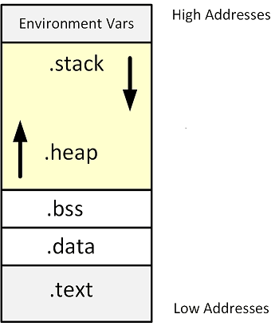

# Local vs. Global Variables

## Local Variables

A variable **declared in the body of a function** is said to be local to the function, thus, we call it a **local variable**.

_Example_: Local variable `result`
```C
int sum_of_integers(int n)
{
    int result;     
    result = n*(n+1)/2;
    return result;
}
```

Local variables have the following properties:
* **Automatic storage duration**. 
    Storage for a local variable is automatically allocated when the enclosing function is called an 
    deallocated when the function returns - **automatic storage duration**.
    A local variable doesn't retain its value when its enclosing function returns.
    When the function is called again, there is no guarantee that the variable will still have its 
    old value.

* **Block scope**.
The scope of a variable is the portion of the program text in which the variable can be referenced.
A local variable is visible from its point of declaration to the end of the enclosing function body - **block scope**.
Since the scope of a local variable doesn't extend beyond the function to which it belongs, other functions can use 
the same name for other purposes.

Since **C99** doesn't require variable declarations to come at the beginning of a function, it is possible for a local 
variable to have a very small scope. Even in a for loop, we can define the loop variable local in the loop body.

_Example_: Block scope
```C
    {
        int i = 7;
        assert(i == 7);
    }
    {
        int i = 3;
        assert(i==3);
    }
    for(int i=0; i<10; i++)
    {
        assert(i < 10);
    }
```

We use the term **block** to describe a compound statement:
```
{
    declarations
    statements
}
```
The body of a function is a block.
Blocks are also useful inside a function body when we need variables for temporary use.
**C99** allows variables to be declared anywhere within a block, just as it allows variables 
to be declared anywhere within a function.

In a C program, the same identifier may have several different meanings.
C's **scope rules** enable the compiler to determine which meaning is relevant at a given point in the program.

_Rule_: When a declaration inside a block names an identfier that is already visible, the new declaration 
temporarily _hides_ the old one, and the identifier takes a new meaning.


### Static Local Variables

A variable with **static storage duration** has a permanent storage location, so it retains its 
value throughout the execution of the program.

_Example_: Static storage duration
```C
int counter(void)
{
    static int value;    
    return value++;
}
```

A **static local variable still has block scope**, so it is not visible to other functions. 


### Parameters
Parameters have the **same properties as local variables** - automatic storage duration and block scope.
The only real difference between parameters and local variables is that each parameter is initialized 
automatically when a function is called.


## Global Variables
Functions can also communicate through global variables - variables that are **declared outside the 
body of any function**.

Global variables have the following properties:
* **Static storage duration**.
    A value stored in an external variable will stay there indefinitely.

* **File scope**.
    A global variable is visible from its point of declaration to the end of the enclosing file.
    As a result, a global variable **can be accessed and modified by all functions** that follow 
    its declaration.

_Example_: Global variable
```C
int counter_value = 0;  
void increment()
{
    counter_value++;
}
void decrement()
{
    counter_value--;
}
```
Global variables are convenient when many functions must share a variable or when a few functions
share a large number of variables.
In general, **it is better for functions to communicate through parameters rather than by sharing 
variables**:
* If we change a global variable during program **maintainance**, we will need to check every 
    function in the same file to see how the change affects it.
* if a global variable is assigned an incorrect value, it may be **difficult to debug** and 
    identify the guilty function.
* Functions that rely on global variables are **hard to reuse** in other programs.
    A function that depends on global variables is not self-contained: to reuse the function we 
    will have to drag along any external variables that it needs.

Many C programmers rely **far to much on global variables** - try to avoid them!
When we use global variables, at least we have to give them **meaningful names** (for local variables, in contrast, 
we often use single characters like `i`). 

# Memory Segments

When a program is started, it's memory is divided into five segments:
* The **.text** segment (or code segment) is where the assembled machine language instructions of 
the program are located. This memory segment has a **fixed size**.
* The **.data** and **.bss** segments are used to store **global and static variables**. 
    The `.data` segment is filled with the initialized global and static variables, 
    while the `.bss` segment is filled with their uninitialized counterparts.
    Although these segments are writable, they also have a **fixed size**.
* The **.heap** segment is a segment of memory a programmer can directly control. 
    Blocks of memory in this segment can be allocated and used for whatever the programmer 
    might need. The heap segment is **not of fixed size**, so it can grow larger or smaller 
    as needed.
* The **.stack** segment is used to store **local variables** and context during functions calls. 
    When a program calls a function that function will have its own set of **parameters**.
    The stack is also **not of a fixed size**.
   


_Example_: Addresses of variables and functions
```
stack segment:
        local_variable                  at 0x7fff6a763744

heap segment:
        heap_ptr                        at 0x55cd397d2260

bss segment:
        global_variable                 at 0x55cd38322058
        static_variable                 at 0x55cd38322050

data segment:
        global_variable_initialized     at 0x55cd3832204c
        static_variable_initialized     at 0x55cd38322054

code segment:
        main()                          at 0x55cd3831f165
```

## References
* K. N. King. **C Programming, A Modern Approach.** W. W. Norton & Company, inc. 2nd Edition 2008. 
    Chapter 10: Program Organization
* Jon Erickson. **Hacking - The Art of Exploitation**. No Starch Press, 2nd Edition, 2008. 

*Egon Teiniker, 2020-2021, GPL v3.0* 