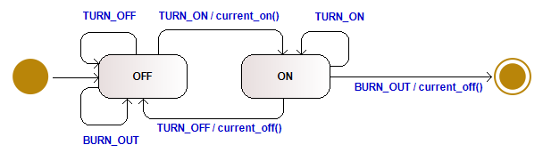

# State Machines

A **State Machine (SM)** (a.k.a. **Finite Automation**) is a way of structuring a program around a 
**set of states** and the **events** that can cause it to change state.

A state machine allows us to reason about all our inputs and all our states such that we 
can **verify that we have accounted for every eventuality**.


## State Machine Diagrams

State machine diagrams are a technique to **describe the behavior of a system** in terms of a
state machine.

### States and Transitions

The state diagram starts with the state of the state machine when it’s created. 
The diagram indicates this with **initial pseudostate**, which is not a state but 
has an arrow that points to the initial state. 

The **final state** indicates that the state machine is completed.


The diagram also gives the rules by which the state machine changes from state to state. 
These rules are in the form of **transitions**, which indicates a movement from one state to another:
```
trigger-signature [guard]/activity 
```
* The **trigger-signature** is usually single event that triggers a potential change of state.
* The **guard** is a boolean condition that must be true for the transition to be taken.
* The **activity** is some behavior that’s executed during the transition.

All three parts to a transition are optional:
* A **missing activity** indicates that the you don’t do anything during the transition.
* A **missing guard** indicates that the transition is always taken if the event occurs.
* A **missing trigger-signature** is rare, but does occur. It indicates that you take the transition immediately.
 
When an event occurs in a state, we can take **only one transition** out of it. 
If we use multiple transitions with the same event, the guards must be mutually exclusive. 

## Example: Light Bulb

Let's look at a concrete example. 
We have given a lightbulb that can have the **states** `OFF` and `ON` as well as `FINAL` in case it's broken.
As a user, we can send the following **events** to the lightbulb: `TURN_ON`, `TURN_OFF` 
and `BURN_OUT`.



Note that every event can occur in every state, but triggers different activities.

To implement a state machine, we must first **evaluate the different states**:

```C
enum sm_states state; 
void sm_light_bulb(enum events event)
{
    print_event(event);

    switch(state)
    {
        case OFF:
            sm_light_bulb_off(event);
            break;

        case ON:
            sm_light_bulb_on(event);
            break;

        case FINAL:
            sm_light_bulb_final(event);
            break;
    }
}
```
A **switch/case statement** is used to **determine the current state** of the SM. 
Depending on the actual state, a suitable handler function is called.

Each **handler function** must define what to do for each event (in a particular state):
```C
// Handle Events in State: OFF
void sm_light_bulb_off(enum events event)
{
    switch(event)
    {
        case TURN_ON:
            current_on();
            state = ON;
        break;

        case TURN_OFF:
        break;

        case BURN_OUT:
        break;
    }
}
```
Activities are mostly encapsulated in their own functions (e.g. `current_on()`) 
which then access the hardware.

Using this pattern, SMs can always be converted into C code using the same implementation scheme.


## Types of State Machine

**UML state machines have the characteristics of both Mealy machines and Moore machines**. 
They support actions that depend on both the state of the system and the triggering event, 
as in Mealy machines, as well as entry and exit actions, which are associated with states 
rather than transitions, as in Moore machines.

* A [**Mealy machine**](https://en.wikipedia.org/wiki/Mealy_machine)
	is a finite-state machine whose **output values are determined both by its current state and the current inputs**. 

* A [**Moore machine**](https://en.wikipedia.org/wiki/Moore_machine)
	is a finite-state machine whose **output values are determined only by its current state**. 

## References
* Martin Fowler. **UML Distilled.** Addison-Wesley. 3rd Edition, 2004
* Michael Sipser. **Introduction of the Theory of Computation.** PWS Publishing, 1997
* [State machines in C](https://yakking.branchable.com/posts/state-machines-in-c/)
* [UML Tool: Modelio](https://www.modelio.org/) 

*Egon Teiniker, 2020-2022, GPL v3.0* 
