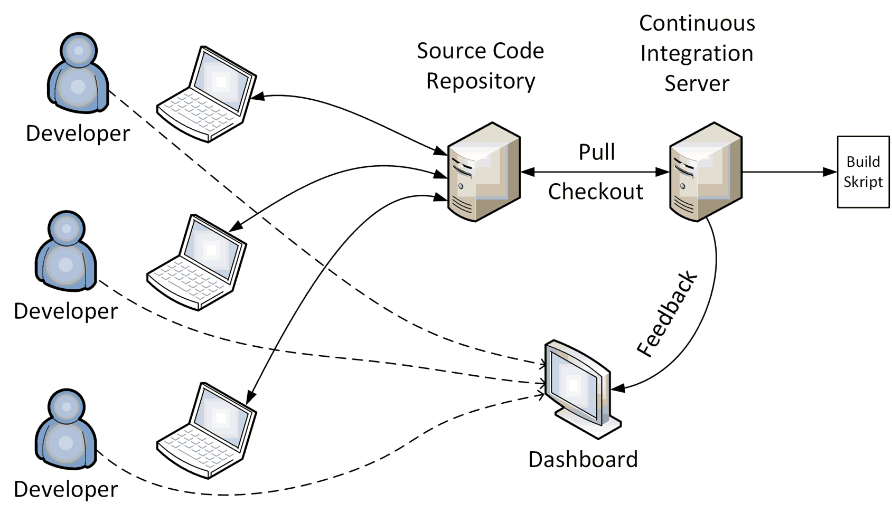

# Continuous Integration

> **Continuous Integration (CI**) is a software development practice 
> where members of a team integrate their work frequently, usually 
> each person integrates at least daily - leading to multiple integrations 
> per day. 
> Each integration is verified by an automated build (including test) 
> to detect integration errors as quickly as possible.

## Continuous Integration Workflow

1. A **developer commits** code to the version control repository. 

2. The CI server detects that changes have occurred in the version control 
    repository, so the **CI server retrieves the latest copy of the code** 
    from the repository and **executes a build script**. 

3. The CI server generates **feedback** (HTML reports, emails) for project 
    members.

4. The **CI server continues to poll for changes** in the version control 
    repository.

The result of the build process on the CI server is a **Release Candidate (RC)**  
that is stored in an **Artifact Repository**.  

All subsequent tests, up to and including deployment, are performed using this RC.

## Benefits of Continuous Integration

* The greatest and most wide-ranging benefit of Continuous Integration 
    is **reduced risk**.

* At all times **you know where you are**, what works, what doesn't, 
    the outstanding bugs you have in your system.

* Continuous Integrations doesn't get rid of **bugs**, but it does make 
    them dramatically **easier to find and remove**.

* Projects with Continuous Integration tend to have dramatically 
    **less bugs, both in production and in process**.

* CI it removes one of the biggest barriers to **frequent deployment**.

## Roadmap to Continuous Integration

1. Get everything you need into **source control**.

2. One of the first steps is to get the **build automated**. 

3. Introduce some **automated testing** into you build.

4. Try to **speed up the commit build**. 

If you are starting a new project, **use Continuous Integration 
from the beginning**. 

## References

* Martin Fowler: [Continuous Integration](http://martinfowler.com/articles)

* Paul M. Duvall. **Continuous Integration -Improving Software Quality and Reducing Risk**. Addison-Wesley, 2007

* Jez Humble, Davis Farley. **Continuous Delivery**. Addison-Wesley, 2010

* [YouTube (Dave Farley): Continuous Delivery Pipelines: How to Build Better Software Faster](https://youtu.be/eoaDr5PpT2c?si=fKfZIJ58cWPUd9P_)

*Egon Teiniker, 2020-2026, GPL v3.0*  
