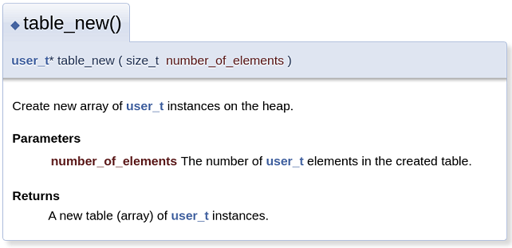

# API Documentation Using Doxygen

Doxygen is the de facto standard tool for **generating documentation from annotated C++ sources**, but it also supports other popular programming languages such as C, Objective-C, C#, PHP, Java, Python, IDL (Corba, Microsoft, and UNO/OpenOffice flavors), Fortran, and to some extent D. Doxygen also supports the hardware description language VHDL.


## Source Code 

A special comment block is a C or C++ style comment block with some additional markings, so doxygen knows it is a piece of structured text that needs to end up in the generated documentation.

### Comment Blocks

For each entity in the code there are two types of descriptions, which together 
form the documentation for that entity, both are optional:
* brief description: As the name suggest, a brief description is a short one-liner. 
* detailed description: The detailed description provides longer, more detailed documentation.


For methods and **functions** there is also a third type of description, the so called in **body description**, which consists of the concatenation of all comment blocks found within the body of the method or function.

_Example_: Doxygen comment block (JavaDoc style)
```C
/**
 * ... text ...
 */
```

_Example_: Doxygen comment block (Qt style)
```C
/*!
 * ... text ...
 */
```

In both cases the intermediate `*` are optional.


### Document Functions

Entities declared at **file scope** are only documented if their file is documented.

So to document a **free function** in the global namespace you also need a line like this somewhere in the header file in which it is declared:

```C
/** @file */
```

For functions, we can use the `@param` command to **document the parameters** and then use `[in]`, `[out]`, `[in,out]` to document the direction.

To **document the return type** of functions, `@return` can be use.


_Example_: Parameters and return values
```C
/**
 * Create new array of user_t instances on the heap.
 * @param number_of_elements The number of user_t elements in the created table.
 * @return A new table (array) of user_t instances. 
 */
extern user_t *table_new(size_t number_of_elements);
```

Here the generated documentation:



### Special Commands

All commands in the documentation start with a an at-sign `@` or backslash `\`. 

* **@note { text }**: Starts a paragraph where a note can be entered. The paragraph will be indented. The text of the paragraph has no special internal structure. All visual enhancement commands may be used inside the paragraph. Multiple adjacent `@note` commands will be joined into a single paragraph. Each note description will start on a new line.  
The `@note` command ends when a blank line or some other sectioning command is encountered. 

* **@see  { references }**: Starts a paragraph where one or more cross-references to classes, functions, methods, variables, files or URL may be specified. 


## Doxygen Configuration and Usage

We start by **generating a Doxygen configuration file**:
```
$ doxygen -g
```

The generated Doxyfile contains a lot of default settings, some of these should be
changed:
```
$ code Doxyfile

PROJECT_NAME           = "struct-usertable"

INPUT                  = ./

OUTPUT_DIRECTORY       = doc 
```

Finally, we **run Doxygen** by passing the Doxyfile:
```
$ doxygen Doxyfile
```

Now, we can review the generated documentation from the `doc/index.html` file.


## References
* [YouTube: Introduction to Doxygen](https://youtu.be/5G1zUpNFmEY)

* [Doxygen Manual: Getting Started](https://www.doxygen.nl/manual/starting.html)
* [Doxygen Manual: Special Commands](https://www.doxygen.nl/manual/commands.html)

* [Automatic online documentation for GitHub projects using Doxygen, Travis CI and GitHub pages](https://joeloskarsson.github.io/2018/automatic-docs)