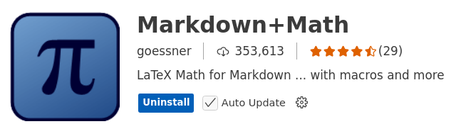

# LaTex Formulars in MD Files 

## Introduction
This document describes how to include LaTex formulars in markdown files.

Write LaTeX using `$...$` (inline) or `$$...$$` (block).

_Example:_ Inline formular - Euler's identity: $e^{i\pi} + 1 = 0$

_Example:_ Block formular - Fundamental theorem of calculus:

$$
\frac{d}{dx} \int_{a}^{x} f(t)dt = f(x)
$$

## Setup 

To include LaTex formulars in markdown files, you need to install the following extension in VS Code:

## References

* [LaTeX for Students – A Simple Quickstart Guide](https://youtu.be/lgiCpA4zzGU?si=X_E8km-zwqy9oksj)
* [Learn LaTeX in 30 minutes](https://www.overleaf.com/learn/latex/Learn_LaTeX_in_30_minutes)

* [VS Code Extension: Markdown+Math](https://marketplace.visualstudio.com/items?itemName=goessner.mdmath)

*Egon Teiniker, 2020-2025, GPL v3.0* 
