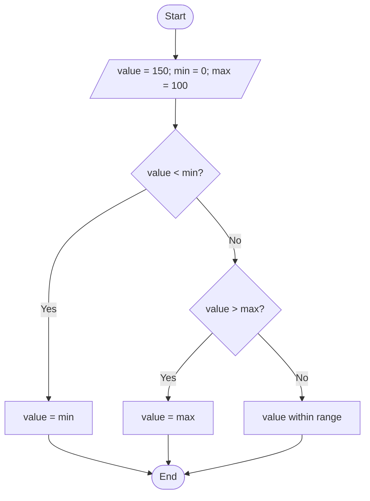
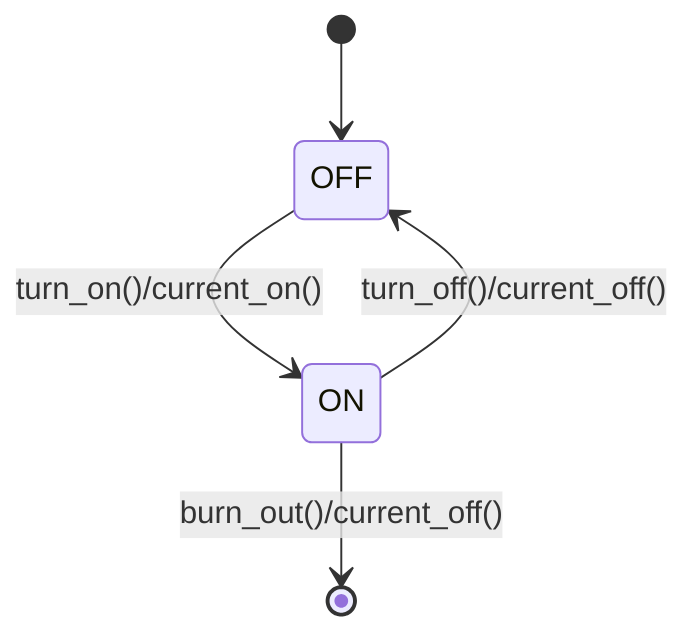
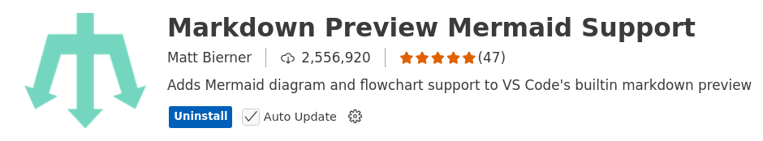

# Mermaid

Mermaid lets create (UML) diagrams and visualizations using text and code.

It is a JavaScript based diagramming and charting tool that renders 
Markdown-inspired text definitions to create and modify diagrams dynamically.

## Flowchart 

A Flowchart is a type of diagram that represents a workflow or process. It is different 
from the UML Activity Diagram in that it does not have a formal specification.

_Example:_

Note that Mermaid does not support UML activity diagrams, but rather a flowchart. 
The notation is similar but not entirely identical. Flowcharts can also be used 
to model the flow of functions.

## UML State Machine Diagram 

_Example:_ Light Bulb State Machine Diagram

## Setup 

To use Mermaid in VS Code, install the following extension:

## References

* [Mermaid User Guide](https://mermaid.js.org/intro/getting-started.html)

* [Mermaid Live Editor](https://mermaid.live/edit)

* [VS Code Extension: Mermaid Editor](https://marketplace.visualstudio.com/items?itemName=tomoyukim.vscode-mermaid-editor)

* [Wikipedia: Flowchart](https://en.wikipedia.org/wiki/Flowchart)

*Egon Teiniker, 2020-2025, GPL v3.0* 