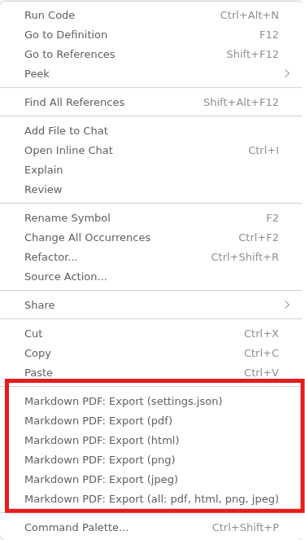

# PDF Export 

## Convert Markdown Files to PDF 

To share MD files, it's helpful to convert them into other formats such as PDF.

The following extension can help with this.

Right-clicking within a MD file opens the **context menu** with 
various export options:

To disable the **header and footer** in the generated PDF file, 
we can switch to the settings and turn off this functionality:

* File | Preferences | Settings |
    - Extensions | MarkdownPDF
        - **[ ]** Display Header and Footer

## Review PDF Files in VS Code 

To view PDF documents in VS Code, the following extension is helpful:

With it, you can **double-click on PDF files** to open the viewer 
and read the PDF file.

*Egon Teiniker, 2020-2026, GPL v3.0*  
