# Class Diagram

A **class diagram** describes the **types of objects** in the system and the various kinds of **static relationships** 
that exist among them.

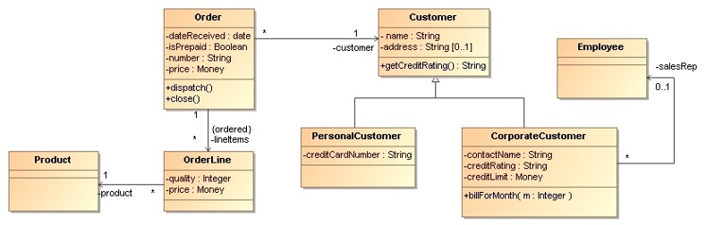

## What are Objects?

An **object** is a discrete entity with a well-defined boundary that encapsulates state and behavior.

The following properties are common to all objects:
* **Identity**: this is the object’s unique existence in time and space. It is what makes it different from all other objects.
* **State**: this is determined by the attribute values of an object and the relationships the object has to other objects at a particular point of time.
* **Behavior**: an operation is the specification of a piece of behavior. An implementation of that behavior is called a method.


## What are Classes?

A **class** is a descriptor for a set of objects that share the same attributes, operations, methods, relationships and behavior.

We can think of a class as  being a **template for objects**.

A class determines the structure (set of features) of all objects of that class:
* Every object is an instance of exactly one class.
* All objects of the same class must have the same set of operations, the same set of attributes,
  and the same set of relationships, but may have different attribute values.

## Object-Oriented Modeling

**Classification** is possibly the single most important way that human beings have of **ordering information about the world**.

Classes allow us to describe the **set of features** that every object of the class must have without having to describe
every one of those objects.

Given that there are so many options, **choosing the most appropriate classification scheme** is one of the most important
aspects of object-oriented analysis and design.

## Class
The UML notation for classes specifies the **name of a class**, its **attributes** and **operations**.

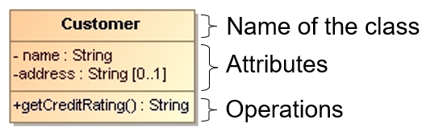

The only **mandatory part of this definition is the name of the class**. All other parts are optional.
Classes represent “things”, so they should have a name that is a noun or a noun phrase.


### Stereotypes
Stereotypes allow us to **define a new UML modeling element based on an existing one**.
We define the semantics of the stereotype ourselves.

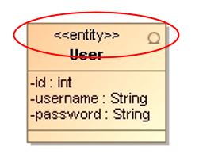

Each model element can have **zero to many stereotypes**.
Notice that we can stereotype relationships as well as classes.


### Properties
Properties represent structural features of a class.
We can think of properties as corresponding to **fields in a class**.

Properties appear in two quite distinct notations:
* **Attributes** The attribute notation describes a property as a line of text within the class box itself.

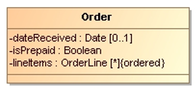

* **Associations** An association is a solid line between two classes, directed from the source class to the target class.

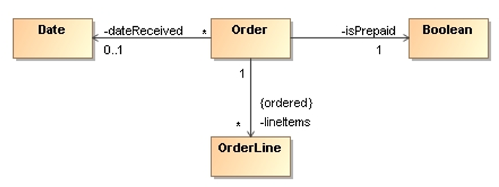

We use attributes for small things (e.g. Booleans), and associations for more significant classes (e.g. Customer).


### Multiplicity
The multiplicity of a property is an indication of how many objects may fill the property.

The most common multiplicities are:
* **[1]** exactly one
* **[0..1]** zero or one (optional)
* **[*]** zero or more

By default, the elements in a multi-valued multiplicity form a set.
If the ordering has meaning, we need to add `{ordered}` to the association end.


### Visibility
A class has public or private elements.

**Public elements** can be used by any other class, **private elements** can be used only by the owning class.
Attributes or operations can be tagged with a **visibility indicator**.

The most common visibility tags are:
* public `+`
* private `-`
* package  `~`
* protected `#`


### Operations
Operations are the **actions that a class knows to carry out**.
Operations most obviously correspond to the **methods on a class**.

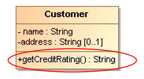

The full UML syntax for operations is:
* **Visibility marker**: public `+`, private `-`
* Name
* Parameter-list
* Return-type
* Property-string


### Static Operations and Attributes
UML refers to an **operation or an attribute that applies to a class** rather than to an instance as static.
This is equivalent to **static members** in object-oriented programming languages.

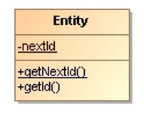

Static features are **underlined on a class diagram**.


### Constructors
Constructors are special operations that initialize new instances of classes – these operations must be **class scoped**.

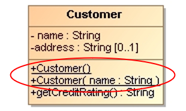

There are different standards for naming constructors:
* A completely generic approach is just to call the constructor `__init__()`, used for example in Python.
* Java, C#, and C++ all demand that the constructor name be the **same as the class name**.


## Relationships Between Classes

Classes do not exist in isolation but are related to each other. 
The nature of the relationship affects the implementation of classes.

### Dependency
A dependency exists between two elements **if changes to the definition of one element may cause changes to the other**.

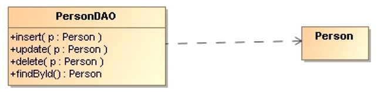

The UML has many varieties of dependency, each with particular semantics and keywords (`<<create>>`, `<<use>>`, etc.).


### Bidirectional Associations
A bidirectional association is a **pair of properties that are linked together as inverses**.

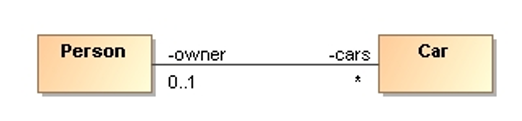

Implementing a bidirectional association in a programming language is often a little tricky
because we have to be sure that both properties are kept synchronized.


### Aggregation
An aggregation is a part-of relationship, we call it an **"has a"** relation.

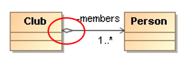

UML includes aggregation but with hardly any semantics.
Therefore, we can say that aggregation is a **modeling placebo**.


### Composition
A composition is a good way of showing properties that own by value,
or properties that have a strong and somewhat **exclusive ownership** of
particular other components.

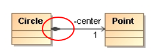

The no sharing rule is the key to composition!
If we delete circle, it should automatically ensure that the owned point is also deleted.


### Generalization
We call generalization (of inheritance - in the opposite direction) a **"is a"** relation.

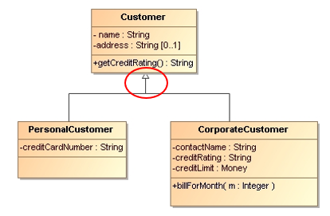

The subclass inherits all the features of the superclass and may override any superclass methods.


### Abstract Class
An abstract class is a class that **cannot be directly instantiated**.
Instead, we instantiate an instance of a subclass.

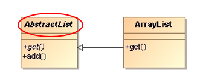

Typically, an abstract class has **one or more operations that are abstract**.
An abstract operation has no implementation, it is pure declaration.


### Interface
An interface is a class that has no implementation, **all its operations are abstract**.
An interface is marked with the keyword `<<interface>>` or a circle to the right of the interface name.

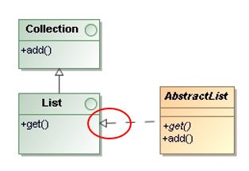

When a **class implements an interface**, we draw a **realization relationship**. 
In principle, this is also an **"ia a"** relationship.

A class **requires an interface** if it needs an instance of that interface in order to work.
A class **provides an interface** if it is suitable for the interface.

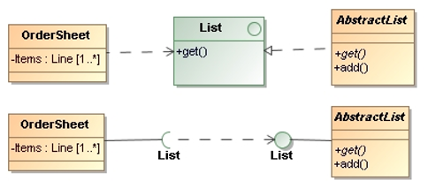

In the class diagram there is a special representation for provided and required interfaces - 
the **lollipop representation**.

Note the **differences between an abstract class and an interface**:
* An **abstract class** has one or more operations that are abstract.
  An abstract class cannot be directly instantiated, we have to instantiate an instance of a subclass.

* An **interface** has no implementation, all its features are abstract.
  A class can provide an interface by implementing it.

Also note the **differences between class inheritance and interface inheritance**:
* **Class inheritance** defines an object’s implementation in terms of another object’s implementation.

* **Interface inheritance** (or subtyping) describes when an object can be used in place of another.


## Parameterized Types
Another technique for **reusing functionality** is through parameterized types, also known as **Generics** in Java
and Templates in C++.

This technique lets us define a type without specifying all the other types it uses.
The unspecified types are supplied as **type parameters** at the point of use.

```Java
public interface List<E> extends Collection<E>
{
    boolean add(E e);
    // ...
};
```

Neither inheritance nor parameterized types can change at run-time!


## Notes
Notes are **comments in the diagrams**.

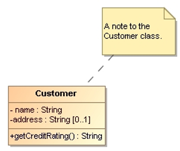

Notes can stand on their own, or they can be linked with a dashed line to the elements they are commenting.


## References

* [YouTube: UML Class Diagram Tutorial](https://youtu.be/UI6lqHOVHic)

* Martin Fowler. **UML Distilled**. Addison-Wesley, 3rd Edition, 2004
  * Chapter 3: Class Diagrams: The Essentials
  * Chapter 5: Class Diagrams: Advanced Concepts

*Egon Teiniker, 2016-2023, GPL v3.0*
