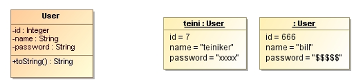
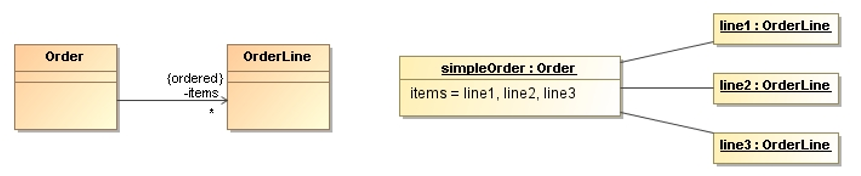
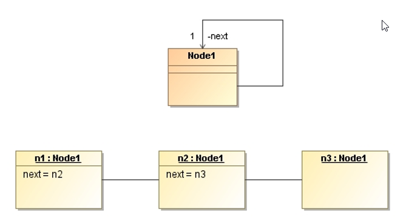
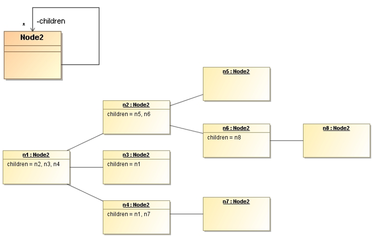
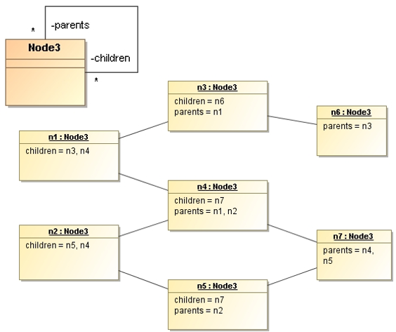

# UML Object Diagram 

An **object diagram** is a **snapshot of the objects in a system at a point in time**.
Because it shows instances rather than classes, an object diagram is often called an instance diagram.

* We can use an object diagram to show an example configuration of objects.
* This is very useful when the possible connections between objects are complicated.

## Instances

The elements of an object diagram are instances.

The following UML notation is used for instances:
* Their **names are underlined**
* Each name takes the form  `instanceName:ClassName` (both parts of the name are optional).
  If we use only the class name, we must include the colon.

## Attribute Values and Links

Object instances can show values for attributes and links.

Strictly, the elements of an object diagram are instance specifications rather than true instances.
It is legal to leave mandatory attributes empty to show instance specifications of abstract classes.

## Class Diagram vs. Object Diagram 

The relationship between class diagrams and object diagrams is important. 
Object diagrams show a possible instantiation of a class diagram. On the other hand, the class 
diagram determines the possibilities of instantiation.

In many situations, we can define a structure precisely with a class diagram,
but the structure is still difficult to understand.
In these situations, a couple of object diagram examples can make all the difference.

_Example: Node List_

A directed association with multiplicity 1 becomes a linked list of objects.

_Example: Node Tree_

Just by changing the multiplicity from `1` to `*`, we create a tree structure from a list of nodes.

_Example: Node Graph_

If we also add a bidirectional association, a graph of nodes results at runtime.

## References

* Martin Fowler. **UML Distilled**. Addison-Wesley, 3rd Edition, 2004
  * Chapter 6: Object Diagrams

*Egon Teiniker, 2016-2023, GPL v3.0*
