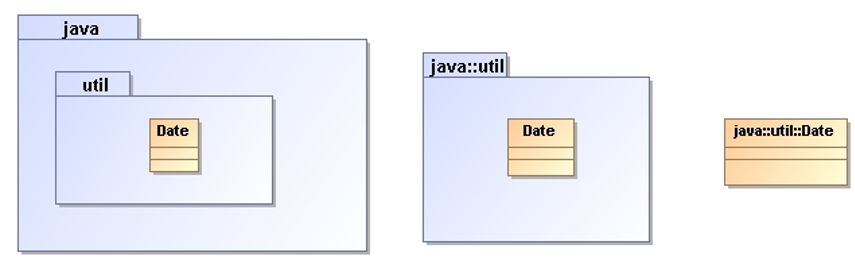
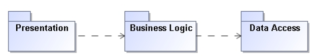

# UML Package Diagram

The UML Package Diagram helps in **visualizing the organization and structure** of the software system 
by showing how the packages are arranged hierarchically and how they depend on each other. 

The diagram consists of packages represented as rectangles, which can contain other packages or individual 
elements. The dependencies between packages are shown as arrows connecting the packages.

Package diagrams represent a **compile-time grouping mechanism**.

## Package

A **package** is a grouping construct that allows you to take any construct in the UML and group its elements together
into higher-level units.

* Each class is a member of a single package.
* Packages can also be members of other packages.
* A package can contain both sub-packages and classes.

In programming terms, packages correspond to such grouping constructs as packages in Java and namespaces in C++.

Each package represents a namespace, which means that every class must have a unique name within its owning package.
We can use double colons to show package names in UML.

## Relationships Between Packages

The main benefit of using UML Package Diagram is that it allows for a better **understanding of the overall
structure** of a system or application and helps in identifying the relationships between various components.
It also helps in managing the complexity of the system by breaking it down into smaller, manageable components
or packages.

### Dependencies

A package diagram shows packages and their dependencies.

In a medium to large system, plotting a package diagram can be
one of the most valuable things you can do to **control the
large-scale structure of the system**.

UML packages also define constructs to allow packages to **import
and merge classes** from one package into another, using dependencies
with keywords to notate this.

### Implementation

Often, we will see a case in which one package defines an interface that can be
implemented by a number of other packages.

It is quite common for an interface and its implementation to be in a separate package.

## References

* Martin Fowler. **UML Distilled**. Addison-Wesley, 3rd Edition, 2004
  * Chapter 7: Package Diagrams
  
*Egon Teiniker, 2016-2023, GPL v3.0*
