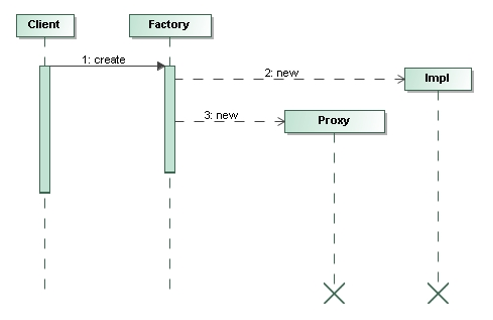
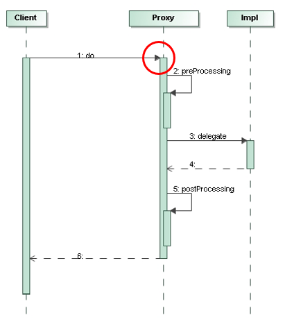
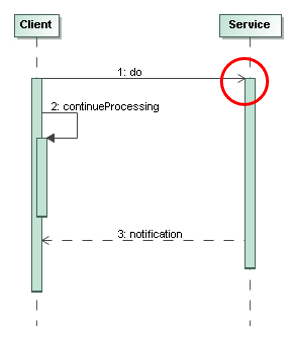

# UML Sequence Diagram

**Interaction diagrams** describe how groups of objects collaborate in some behavior.
Typically, a sequence diagram captures the behavior of a **single scenario**.

**Sequence diagrams** show the interaction by showing each participant with a lifeline that runs vertically
down the page and the ordering of messages by reading down the page.

We should use sequence diagrams when we want to look at the behavior
of several objects within a single use case.

Sequence diagrams are good at showing collaborations among the objects,
they are not so good at precise definition of the behavior.

## Creating and Deleting Participants

To **create a participant**, draw the message arrow directly into the participant box.

**Deletion of a participant** is indicated by big `X`.

## Synchronous Messages

Filled arrowheads show a synchronous message.

If a caller sends a synchronous message, it must wait until the message is done, such as invoking a subroutine.

## Asynchronous Messages

Stick arrowheads show an asynchronous message.

If a caller sends an asynchronous message, it can continue processing and does not have to wait for response.

## References

* Martin Fowler. **UML Distilled**. Addison-Wesley, 3rd Edition, 2004
    * Chapter 4: Sequence Diagrams

*Egon Teiniker, 2016-2023, GPL v3.0*