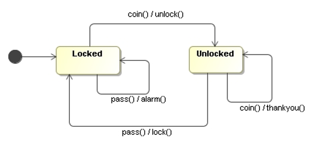
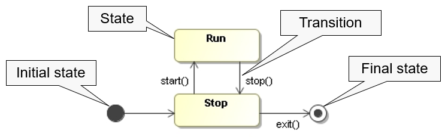
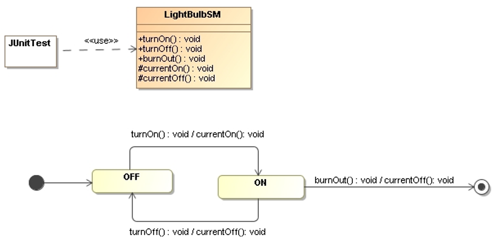
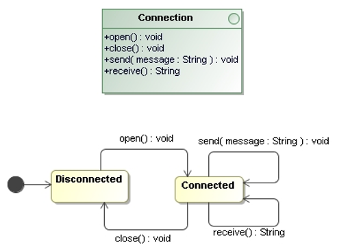
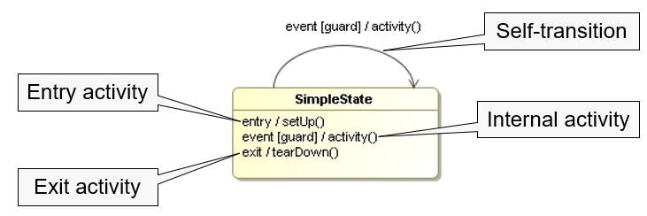
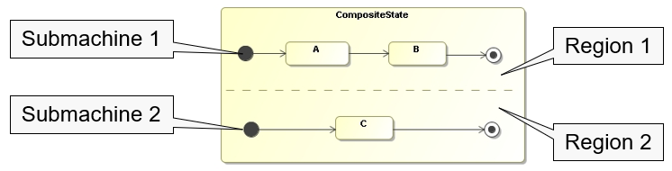
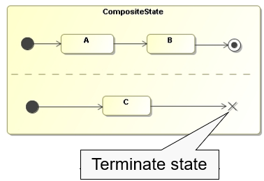

# UML State Machine Diagram

In object-oriented approaches, state machine diagrams are used to **show the lifetime behavior of a single object**.



## States and Transitions
When we talk about objects, we often refer to the state of these objects to mean 
the combination of all the data in the fields of an object. 

However, the **state** in a state machine diagram is a more abstract notation of state - 
essentially, different states imply a **different way of reacting to event**.

The state diagram starts with the state of the controller object when it’s created. 
The diagram indicates this with **initial pseudostate**, which is not a state but 
has an arrow that points to the initial state. 

The **final state** indicates that the state machine is completed, implying the deletion 
of the controller object.



The diagram also gives the rules by which the controller changes from state to state. 
These rules are in the form of **transitions**, which indicates a movement from one state 
to another:
```
    trigger-signature [guard]/activity 
```
* The `trigger-signature` is usually single event that triggers a potential change of state.
* The `guard` is a boolean condition that must be true for the transition to be taken.
* The `activity` is some behavior that’s executed during the transition.

All three parts to a transition are optional:
* A missing `activity` indicates that the you don’ t do anything during the transition.
* A missing `guard` indicates that you always take the transition if the event occurs.
* A missing `trigger-signature` is rare, but does occur. 
    It indicates that you take the transition immediately.

When an event occurs in a state, you can take **only one transition out of it**. 
If you use multiple transitions with the same event, the guards must be mutually exclusive. 


## Behavioral and Protocol State Machines

UML 2 defines two kinds of state machines:
* **Behavioral state machines** use states, transitions, and triggers to **define the 
    behavior of a classifier**. States in behavioral state machines can **specify one 
    or more activities** that execute when the state is entered.

* **Protocol state machines** use states, transitions, and triggers to **define the 
    protocol of a classifier**. Protocol state machines say nothing about the 
    implementation of the behavior – they only define how the behavior appears to 
    an external client.
    States in protocol state machines **can’t specify activities**.  

_Example_: Behavioral State Machine (Light Bulb)



_Example_: Protocol State Machine (Light Bulb)


_Example_: Protocol State Machine (Connection)



## Internal Activities
States can react to events without transition, using internal activities: 
putting the event, guard, and activity inside the state box itself.
The syntax for internal activities follows the same logic for event, guard, and activity.

An internal activity is similar to a **self-transition**: a transition that 
loops back to the same state.

There are two special activities:
* The **entry activity** is executed whenever we enter a state.
* The **exit activity** is executed whenever we leave a state.



Note that **internal activities do not trigger the entry and exit activities**. 
That is the difference between internal activities and self-transitions.


## Activity States

In the states described so far, the controller object is quiet and waiting for 
the next event before it does something.

There can be states in which the object is doing some ongoing work.
In such an **activity state**: The ongoing activity is marked with **do/** 
hence the term **do-activity**.

Both do-activities and regular activities represent carrying out some behavior. 
The critical difference between the two is that **regular activities cannot be 
interrupted** by regular events, while **do-activities can be interrupted**. 

## State Machines and Classes
State machines are most commonly used to model the **dynamic behavior of classes**:
* Each class can have **a single behavioral state machine** that models all the 
    possible states, triggers, and transitions for all instances of that class.
* Each class can have **one or more protocol state machines**, although these 
    are more often used with behaviorless classifiers such as **interfaces**.
* A class inherits the protocol state machines of its parents.
* If a class has more than one state machine, they must be consistent with each other.

## Composite States

A composite state is **a state that contains nested states**.



Composite states are organized into one or more state machines called **submachines**. 
Each submachine exists in its **own region** within the composite state icon.

* **Nested states** inherit all of the transitions of their containing states.
* The **final pseude-state** of a submachine only applies within that region. 
    For example, if the submachine in region 1 reaches its final state first, 
    that region will terminate, but region 2 will continue to execute.
* If we wish to stop the execution of the whole composite state, we can use 
    the **terminate pseude-state**. 




## When to Use State Diagrams?

State diagrams are good at describing the behavior of an object across several 
use cases.

State diagrams are not very good at describing behavior that involves a number 
of objects collaborating.

Use state diagrams only for those classes that exhibit interesting behavior, where building 
the state diagram helps you to understand what is going in.

UI and control objects have the kind of behavior that is useful to depict with 
a state diagram.


## References
* Martin Fowler. **UML Distilled**. Addison-Wesley, 3rd Edition, 2004
    * Chapter 10: State Machine Diagrams

*Egon Teiniker, 2016-2023, GPL v3.0*
