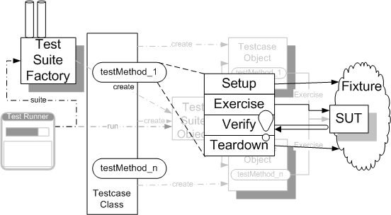

# Unit Testing 

All frameworks of the **xUnit** family implement a basic set of features.



The individual parts of the test setting are:

* **System under Test (SUT)**: Whatever thing we are testing. The SUT is 
always defined from the perspective of the test. When we are writing unit 
tests, the SUT is whatever class, object, or method we are testing.

* **Depended-on Component (DOC)**: An individual class or a large-grained 
component on which the SUT depends. The dependency is usually one of 
delegation via method calls.

* **Test Fixture**: The test fixture is everything we need to have in place 
to exercise the SUT. It includes at least an instance of the SUT. 
It also may include some DOC instances.

* **Test Suite**: We define a composite test case called test suite to hold 
a collection of individual test cases to execute. Test suites (or suites of 
suites) allow to run all test cases with a single command.

* **Test Runner**: Tests are run by using a test runner which 
constructs a test suite containing all of the test methods in the test case 
class.

* **Test Results**: Test results are classified into one of three categories:
    * A test is considered to have **failed** when an assertion fails.
    * A test is considered to have an **error** when either the SUT or the 
    test itself fails in an unexpected way.
    * When a test runs without any error of failures, it is considered to be 
    **successful**.
    
	For each test error or test failure, xUnit records information that can be examined to help understand exactly what went wrong.

## Four-Phases of a Test

Each test is represented by a test method that implements a single 
four-phase procedure:
* **Setup**: We set up the test fixture that is required for the SUT to exhibit the expected behavior as well as anything we need to put in place to be able to observe the actual outcome.

* **Exercise**: We interact with the SUT.

* **Verify**: We do whatever is necessary to determine whether the expected 
outcome has been obtained.

* **Teardown**: We tear down the test fixture to put the world back into the 
state in which we found it.

_Example_: The four test phases implemented in a single test function
```C
char buffer[81];

void test_A(void)
{
    // Setup
    memset(buffer, 0x00, sizeof buffer);
    
    // Exercise
    int len = sprintf(buffer,"Hello");
    
    // Verify
    TEST_ASSERT_EQUAL_STRING("Hello", buffer);
    TEST_ASSERT_EQUAL(5, len);
    
    // Teardown
}
```
To **avoid code redundancies** we can use explicit setup and teardown functions. 

_Example_: Setup and teardown implemented in separate functions 
```C
char buffer[81];

void setUp(void)
{
    // Setup
    memset(buffer, 0x00, sizeof buffer);
}

void tearDown(void)
{
    // Teardown 
}

void test_NoFormatString(void)
{
    // Exercise
    int len = sprintf(buffer,"Hello");
    
    // Verify
    TEST_ASSERT_EQUAL_STRING("Hello", buffer);
    TEST_ASSERT_EQUAL(5, len);
}
```

The **Test Runner** executes `setUp()` before, and `tearDown()` after 
each test function.

_Example_: Execution order enforced by the test runner 
```C
Setup
Test_A
Teardown
unit_test.c:31:test_A:PASS

Setup
Test_B
Teardown
unit_test.c:32:test_B:PASS

-----------------------
2 Tests 0 Failures 0 Ignored 
OK
```

Note that `setUp()` and `tearDown()` isolate the individual test cases from each other. 
Each test case begins with the same prerequisites. 

Therefore, **test cases can be executed in any order and as often as required**.


## References
* Gerard Meszaros. **xUnit Test Patterns**. Addison-Wesley, 2007 
* [XUnit Basics](http://xunitpatterns.com/XUnitBasics.html)
* [Unity: Getting Started](https://github.com/ThrowTheSwitch/Unity/blob/master/docs/UnityGettingStartedGuide.md)
* [Unity: Assertions Reference](https://github.com/ThrowTheSwitch/Unity/blob/master/docs/UnityAssertionsReference.md)
 
*Egon Teiniker, 2020, GPL v3.0* 