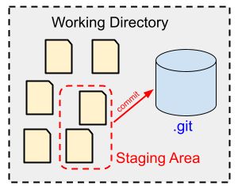

# Add Files

In this example we add some C source files to our local repository.




## Create a Simple C Example

We change into our **working directory**:

```bash
$ mkdir -p sandbox/c-examples
$ cd sandbox/c-examples
```

Next, we implement a simple C file called "complex_numbers.c":

```bash
$ code complex_numbers.c
```

```C
#include <stdio.h>
#include <memory.h>
#include <stdlib.h>

typedef struct complex_number
{
    double re;
    double im;
} complex;

complex complex_add(complex a, complex b)
{
	complex c;
    c.re = a.re + b.re;
    c.im = a.im + b.im;
    return c;
}

int main(void)
{
    complex c1 = {1.0, 1.0};
    complex c2;
    c2.re = 2.0;
    c2.im = 4.0;

    printf("c1 = (%f,%f)\n", c1.re, c1.im);
    printf("c2 = (%f,%f)\n", c2.re, c2.im);
    
    complex result = complex_add(c1,c2);
    printf("c1 + c2 = (%f,%f)\n", result.re, result.im);

    complex *c_ptr;
    c_ptr = (complex*)malloc(sizeof(complex)); 
    c_ptr->re = 7.0;
    c_ptr->im = -13.0;
    printf("*c_ptr = (%f,%f)\n", c_ptr->re, c_ptr->im);    
    free(c_ptr);
    
    return 0;
}    
```

Also, let's create a `README.md` file:

```
# README

This is just a simple markdown file which will be:
* created
* committed 
* and finally removed
```

We compile the C file into an execuable:

```bash
$ mkdir build
$ gcc -Wall -o build/complex_numbers complex_numbers.c

$ tree
.
├── build/
|   └── complex_numbers
├── README.md
└── complex_numbers.c
```

To execute the binary type:

```bash
$ ./build/complex_numbers 
c1 = (1.000000,1.000000)
c2 = (2.000000,4.000000)
c1 + c2 = (3.000000,5.000000)
*c_ptr = (7.000000,-13.000000)
```

Well done. 

Now we have a very simple C project which we can put into a
git repository.

```bash
$ ll -a
drwxr-xr-x  3 student student  4096 May  2 14:26 .
drwxr-x--- 15 student student  4096 May  2 10:08 ..
drwxr-xr-x  1 student student 16752 May  2 10:10 build
-rw-r--r--  1 student student   767 May  2 10:50 complex_numbers.c
drwxr-xr-x  8 student student  4096 May  2 14:26 .git
-rw-r--r--  1 student student   105 May  2 14:55 README.md
```

```bash
$ git status
On branch master

No commits yet

Untracked files:
  (use "git add <file>..." to include in what will be committed)
	README.md
  complex_numbers
	complex_numbers.c

nothing added to commit but untracked files present (use "git add" to track)
```

## Files to be Ignored

Before we add files to the local repository, we have to tell git which 
files should not be managed by providing a **.gitignore** file:

```bash
$ code .gitignore
# Files ignored by Git:
build
```

By convention the name of the file containing a list of ignored files
is `.gitignore`.


## Add Files to the Local Repository

To add untracked files to the repository, first place them in the 
**staging area**, then create a commit:

```bash
$ git add .gitignore 
$ git add complex_numbers.c README.md 

$ git status
On branch master

No commits yet

Changes to be committed:
  (use "git rm --cached <file>..." to unstage)
	new file:   .gitignore
  new file:   README.md
	new file:   complex_numbers.c
```

```bash
$ git commit -m "Initial import."
[master (Basis-Commit) bdbd20e] Initial import.
 3 files changed, 42 insertions(+)
 create mode 100644 .gitignore
 create mode 100644 README.md
 create mode 100644 complex_numbers.c

$ git status
On branch master
nothing to commit, working tree clean
```

Now, all files (except those listed in `.gitignore`) are tracked 
by the local Git repository.


## References
* [Git Reference Manual](https://git-scm.com/docs)
* [Pro Git Book](https://git-scm.com/book/en/v2)

*Egon Teiniker, 2020-2026, GPL v3.0*
