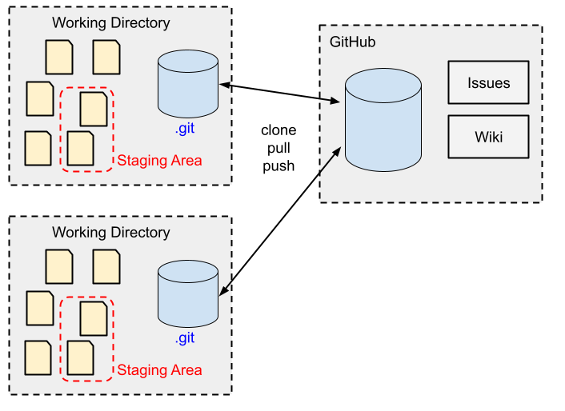

# Clone a Remote Repository

This example shows how a remote repository can be used.



## Clone a GitHub Repository 

A GitHub repository can be visited via a Web browser. We can review all
source files and read documentation.
To download a copy of this repository we use the **clone** operation.

We start by modifying a file from the versioned project.
```bash
$ mkdir sandbox
$ cd sandbox

$ git clone https://github.com/teiniker/teiniker-lectures-computerscience
```

Note that every change in the repository can be transferred to 
the local repository by a simple update command:

```bash
$ git pull
```

## References
* [Git Reference Manual](https://git-scm.com/docs)
* [Pro Git Book](https://git-scm.com/book/en/v2)

*Egon Teiniker, 2020-2026, GPL v3.0*

