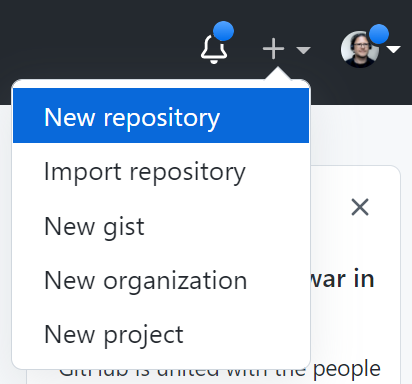

# Create a Remote Repository on GitHub

## GitHub Account 

First, we need a GitHub account.

So, we go to [GitHub](https://github.com/) and **Sign Up**. 

With a valid GitHub account we can: 
* **create new repositories** 
* **participate in other repositories**

In oder to create new repositories, we select the **New repository** menu
item.



After typing a **repository name** and choosing a **license** we can create the repository.


## Using the Web Interface

We can **create**, **edit** and **view files** using the GitHub web interface, as you already know from this Computer Engineering repository.


## Using SSH to Connect to GitHub 

To connect a client to GitHub vis SSH, we have to:

* Create a SSH key pair on the local box
    ```
    $ ssh-keygen -t ed25519 -C "your_email@example.com"
    ```

* Add the SSH private key to the ssh-agent 
    ```
    $ ssh-add ~/.ssh/id_ed25519    
    ```

* Add the SSH key to your account on GitHub
    * On **GitHub**, in the upper-right corner, click your profile photo, then click **Settings**.    
    * In the **Access** section of the sidebar, click **SSH and GPG keys**.
    * Click **New SSH key** or **Add SSH key**. Open `.ssh/id_ed25519.pub` and copy the content. 
    ```
    $ code .ssh/id_ed25519.pub
    ```
    * Testing the SSH connection
    ```
    $ ssh -T git@github.com
    ```

* Check out a repository via SSH 
    ```
    $ git clone git@github.com:teiniker/teiniker-lectures-computerscience.git
    ```


## References
* [GitHub](https://github.com/)

* [Git and GitHub Tutorials: Creating Repositories and Commits](https://youtu.be/hMfi_ONvGEs)

* [YouTube: Setting Up SSH Keys for GitHub](https://youtu.be/8X4u9sca3Io)
* [Connecting to GitHub with SSH](https://docs.github.com/en/authentication/connecting-to-github-with-ssh)

*Egon Teiniker, 2020-2022, GPL v3.0*
