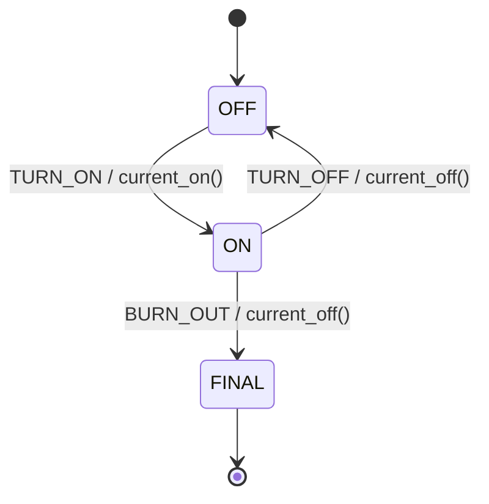

# State Machine: LED

A **Finite State Machine (FSM)** models the behavior of a system that can exist in a finite number of states, transitioning between them in response to events.

This example implements the LED state machine in C, split into a header file, an implementation file, and a test file.


## State Machine Diagram

```
           TURN_ON / current_on()
  ┌─────────────────────────────────┐
  │                                 ▼
 [OFF] ◄──────────────────────── [ON]
              TURN_OFF /             │
              current_off()          │ BURN_OUT /
                                     │ current_off()
                                     ▼
                                 [FINAL]
```



### States

| State   | Description                              |
|---------|------------------------------------------|
| `OFF`   | Initial state — LED is off, ready to use |
| `ON`    | LED is on and consuming current          |
| `FINAL` | Terminal state — LED has burned out      |

### Events

| Event      | Description                       |
|------------|-----------------------------------|
| `TURN_ON`  | Request to switch the LED on      |
| `TURN_OFF` | Request to switch the LED off     |
| `BURN_OUT` | LED filament failure              |

### Transitions

| Current State | Event      | Next State | Activity        |
|---------------|------------|------------|-----------------|
| `OFF`         | `TURN_ON`  | `ON`       | `current_on()`  |
| `ON`          | `TURN_OFF` | `OFF`      | `current_off()` |
| `ON`          | `BURN_OUT` | `FINAL`    | `current_off()` |

All other event/state combinations are ignored (self-loops with no action).


## Project Structure

```
sm-led/
├── led.h       # Public interface: enums for events/states, sm_led() prototype
├── led.c       # Implementation: state handlers and activity functions
├── test.c      # Unity-based unit tests
├── Makefile    # Build and test automation
└── README.md   # This file
```

### led.h

Declares the `led_event` and `led_state` enums, the global `state` variable, and the `sm_led()` function prototype.

### led.c

Implements the state machine dispatcher `sm_led()`, which calls per-state handler functions (`sm_led_handler_off`, `sm_led_handler_on`, `sm_led_handler_final`). Activity functions `current_on()` and `current_off()` simulate hardware output and are defined as `static`.

### test.c

Uses the [Unity](http://www.throwtheswitch.org/unity) test framework. Each test resets `state = OFF` in `setUp()` and then drives the FSM through a sequence of events, asserting the expected resulting state.


## Build and Run

```bash
$ make
```

Expected output:

```
TURN_ON  => current ON  --o=o--
TURN_OFF => current OFF --o o--
TURN_ON  => current ON  --o=o--
BURN_OUT => current OFF --o o--
TURN_OFF =>
BURN_OUT =>

-----------------------
3 Tests 0 Failures 0 Ignored
OK
```


## References

* [Miro Samek. **Practical UML Statecharts in C/C++**. Newnes, 2008](https://www.state-machine.com/qm/sm_basics.html)
* [Wikipedia: Finite-state machine](https://en.wikipedia.org/wiki/Finite-state_machine)

*Egon Teiniker, 2020-2026, GPL v3.0*
