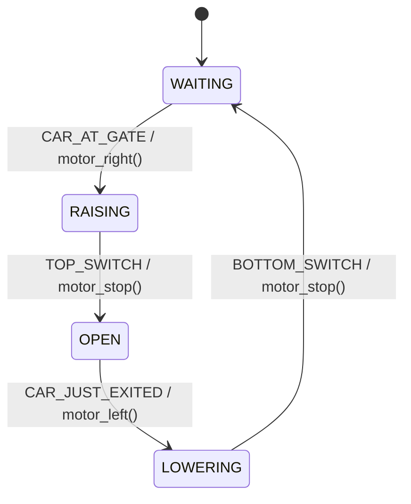

# State Machine: Parking Gate

A **Finite State Machine (FSM)** models the behavior of a system that can exist in a finite number of states, transitioning between them in response to events.

This example implements a parking gate controller in C: when a car arrives the gate motor raises the barrier, holds it open while the car passes, then lowers it again ready for the next vehicle.


## State Machine Diagram

```
         CAR_AT_GATE /                    TOP_SWITCH /
         motor_right()                    motor_stop()
[WAITING] ──────────────► [RAISING] ─────────────────► [OPEN]
    ▲                                                      │
    │                                                      │ CAR_JUST_EXITED /
    │  BOTTOM_SWITCH /                                     │ motor_left()
    │  motor_stop()                                        ▼
    └─────────────────────────────────── [LOWERING]
```



### States

| State      | Description                                          |
|------------|------------------------------------------------------|
| `WAITING`  | Initial state — gate is closed, waiting for a car    |
| `RAISING`  | Motor is running clockwise to raise the barrier      |
| `OPEN`     | Barrier is fully raised, car can pass through        |
| `LOWERING` | Motor is running counter-clockwise to lower barrier  |

### Events

| Event            | Description                                         |
|------------------|-----------------------------------------------------|
| `CAR_AT_GATE`    | Sensor detects a car in front of the gate           |
| `TOP_SWITCH`     | Limit switch triggered — barrier is fully raised    |
| `CAR_JUST_EXITED`| Sensor detects the car has cleared the gate         |
| `BOTTOM_SWITCH`  | Limit switch triggered — barrier is fully lowered   |

### Transitions

| Current State | Event             | Next State | Activity        |
|---------------|-------------------|------------|-----------------|
| `WAITING`     | `CAR_AT_GATE`     | `RAISING`  | `motor_right()` |
| `RAISING`     | `TOP_SWITCH`      | `OPEN`     | `motor_stop()`  |
| `OPEN`        | `CAR_JUST_EXITED` | `LOWERING` | `motor_left()`  |
| `LOWERING`    | `BOTTOM_SWITCH`   | `WAITING`  | `motor_stop()`  |

All other event/state combinations are ignored (no action, no state change).


## Project Structure

```
sm-parking-gate/
├── parking_gate.h   # Public interface: enums for events/states, sm_parking_gate() prototype
├── parking_gate.c   # Implementation: state handlers and motor activity functions
├── test.c           # Unity-based unit tests
├── Makefile         # Build and test automation
└── README.md        # This file
```

### parking_gate.h

Declares the `gate_event` and `gate_state` enums, the global `state` variable, and the `sm_parking_gate()` function prototype.

### parking_gate.c

Implements the state machine dispatcher `sm_parking_gate()`, which delegates to per-state handler functions (`sm_parking_gate_handler_waiting`, `_raising`, `_open`, `_lowering`). The motor activity functions `motor_right()`, `motor_stop()`, and `motor_left()` are `static` — they simulate hardware output and are internal to this module.

### test.c

Uses the [Unity](http://www.throwtheswitch.org/unity) test framework. Each test resets `state = WAITING` in `setUp()` and drives the FSM through a sequence of events, asserting the expected state after each transition. Tests cover both the happy path and ignored-event behaviour in every state.


## Build and Run

```bash
$ make
```

Expected output:

```
MOTOR: >>>
MOTOR: ---
MOTOR: <<<
MOTOR: ---
...

-----------------------
5 Tests 0 Failures 0 Ignored
OK
```


## References

* [Miro Samek. **Practical UML Statecharts in C/C++**. Newnes, 2008](https://www.state-machine.com/qm/sm_basics.html)
* [Wikipedia: Finite-state machine](https://en.wikipedia.org/wiki/Finite-state_machine)

*Egon Teiniker, 2020-2026, GPL v3.0*
