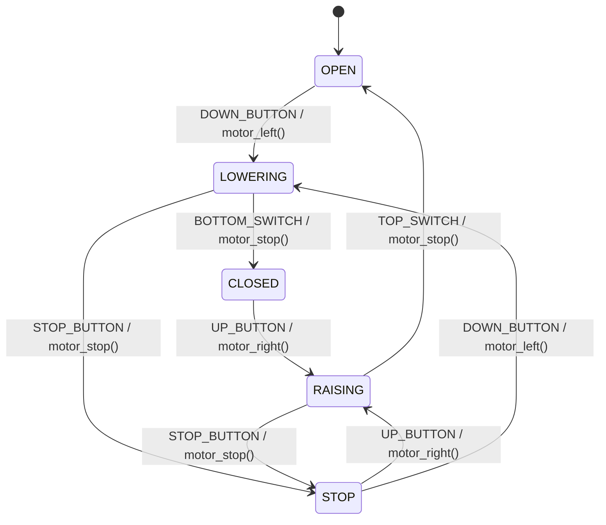

# State Machine: Roller Blind

A **Finite State Machine (FSM)** models the behavior of a system that can exist in a finite number of states, transitioning between them in response to events.

This example implements a motorised roller blind controller in C. The blind can be raised or lowered, paused mid-travel with a stop button, and resumes in either direction from the stopped position.


## State Machine Diagram

```
        DOWN_BUTTON /              BOTTOM_SWITCH /
        motor_left()               motor_stop()
[OPEN] ──────────────► [LOWERING] ─────────────────► [CLOSED]
  ▲                        │                              │
  │    TOP_SWITCH /         │ STOP_BUTTON /               │ UP_BUTTON /
  │    motor_stop()         │ motor_stop()                │ motor_right()
  │                         ▼                             │
  │                       [STOP] ◄────────────────────────┘
  │                         │  STOP_BUTTON /
  │          UP_BUTTON /    │  motor_stop()
  │          motor_right()  │
  └──────── [RAISING] ◄─────┘
                │      DOWN_BUTTON /
                │      motor_left()
                │      ──► [LOWERING]
```



### States

| State      | Description                                              |
|------------|----------------------------------------------------------|
| `OPEN`     | Initial state — blind is fully raised                    |
| `LOWERING` | Motor running counter-clockwise, blind moving down       |
| `RAISING`  | Motor running clockwise, blind moving up                 |
| `STOP`     | Motor halted mid-travel, awaiting next direction command |
| `CLOSED`   | Blind is fully lowered                                   |

### Events

| Event           | Description                                          |
|-----------------|------------------------------------------------------|
| `UP_BUTTON`     | User presses the raise button                        |
| `DOWN_BUTTON`   | User presses the lower button                        |
| `STOP_BUTTON`   | User presses the stop button                         |
| `TOP_SWITCH`    | Limit switch triggered — blind is fully raised       |
| `BOTTOM_SWITCH` | Limit switch triggered — blind is fully lowered      |

### Transitions

| Current State | Event           | Next State | Activity        |
|---------------|-----------------|------------|-----------------|
| `OPEN`        | `DOWN_BUTTON`   | `LOWERING` | `motor_left()`  |
| `LOWERING`    | `BOTTOM_SWITCH` | `CLOSED`   | `motor_stop()`  |
| `LOWERING`    | `STOP_BUTTON`   | `STOP`     | `motor_stop()`  |
| `CLOSED`      | `UP_BUTTON`     | `RAISING`  | `motor_right()` |
| `RAISING`     | `TOP_SWITCH`    | `OPEN`     | `motor_stop()`  |
| `RAISING`     | `STOP_BUTTON`   | `STOP`     | `motor_stop()`  |
| `STOP`        | `UP_BUTTON`     | `RAISING`  | `motor_right()` |
| `STOP`        | `DOWN_BUTTON`   | `LOWERING` | `motor_left()`  |

All other event/state combinations are ignored (no action, no state change).


## Project Structure

```
sm-roller-blind/
├── roller_blind.h   # Public interface: enums for events/states, sm_roller_blind() prototype
├── roller_blind.c   # Implementation: state handlers and motor activity functions
├── test.c           # Unity-based unit tests
├── Makefile         # Build and test automation
└── README.md        # This file
```

### roller_blind.h

Declares the `blind_event` and `blind_state` enums, the global `state` variable, and the `sm_roller_blind()` function prototype.

### roller_blind.c

Implements the state machine dispatcher `sm_roller_blind()`, which delegates to per-state handler functions. The motor activity functions `motor_right()`, `motor_stop()`, and `motor_left()` are `static` — they simulate hardware output and are internal to this module.

### test.c

Uses the [Unity](http://www.throwtheswitch.org/unity) test framework. Each test resets `state = OPEN` in `setUp()` and drives the FSM through event sequences, asserting state after each transition. Tests cover all six travel scenarios (direct, stop-resume same direction, stop-reverse direction) and ignored events in the terminal states.


## Build and Run

```bash
$ make
```

Expected output:

```
MOTOR: <<<
MOTOR: ---
...

-----------------------
8 Tests 0 Failures 0 Ignored
OK
```


## References

* [Miro Samek. **Practical UML Statecharts in C/C++**. Newnes, 2008](https://www.state-machine.com/qm/sm_basics.html)
* [Wikipedia: Finite-state machine](https://en.wikipedia.org/wiki/Finite-state_machine)

*Egon Teiniker, 2020-2026, GPL v3.0*
