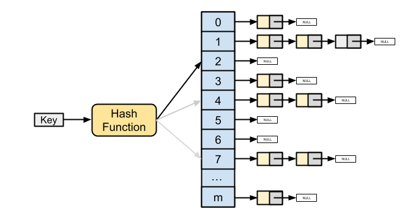

# Hash Table 

A hash table is a data structure that implements an **associative array**, 
a structure that can **map keys to values**. 



We use a **hash function** to compute an index into an **array 
of buckets** or slots, from which the desired value can be found.

## Hash Function

The hash function takes a `key` and returns an index in the array.

This function is a simple hash function, often used in hash tables or similar 
data structures. It maps an integer `key` to a valid index within a fixed range 
(`dimension`).

```C
size_t hash_value(size_t dimension, int key) 
{
    return (size_t)(abs(key) % dimension);
}
```

* `dimension`: Represents the size of the hash table or the range of possible hash values.
* `key`: The integer value to be hashed.

* `abs(key)`: Ensures that the key is non-negative, as negative indices are not valid in an array.

* `% dimension`: Computes the modulus of the absolute key with respect to the size of the hash table, ensuring that the resulting index is within the bounds of the array.

* `size_t`: The return type of the function, indicating that it returns an unsigned integer value representing the index in the hash table.

The hash function should be **deterministic**, meaning that the same key
should always return the same index.

The hash function should also be **fast** to compute, and should distribute
the keys uniformly across the array.


## Hash Table Implementation 

A hash table is typically implemented as an **array of linked lists**. Each
index in the array corresponds to a linked list that contains all the keys
that hash to that index.

```C
table_t *table = NULL;

void setUp(void)
{
	table = table_new(5);
    table_put(table, 11, 111111);
    table_put(table, 22, 222222);
    table_put(table, 33, 333333);
    table_put(table, 44, 444444);
    table_put(table, 55, 555555);
    table_put(table, 66, 666666);
    table_put(table, 77, 777777);
}
```

Here we create a hash table with 5 buckets and add some key-value pairs to it.

When we print the table, we can see how the keys are distributed across the
buckets:

```
Bucket 0: (55 => 555555)
Bucket 1: (66 => 666666) (11 => 111111)
Bucket 2: (77 => 777777) (22 => 222222)
Bucket 3: (33 => 333333)
Bucket 4: (44 => 444444)
```


## References

* [YouTube (CS50): Hash Tables](https://youtu.be/nvzVHwrrub0?si=Th6DkK1RRF2tYOZr)
* [YouTube (Jacob Sorber): Understanding and implementing a Hash Table (in C)](https://youtu.be/2Ti5yvumFTU?si=k7Ed09MRc6SmzTh9)

*Egon Teiniker, 2020-2025, GPL v3.0*  