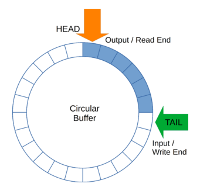

# Circular Buffer

A circular buffer is an **array of constant length**, and we use it to store data 
in a **continuous loop**. It is also known as a **ring buffer** because it stores 
the data circularly.

Circular buffers have a pointer that points to the next empty position of the buffer, and we increment this pointer with each new entry. This means that when the buffer is full, and we add a new element, it overwrites the oldest element. This ensures that the buffer does not overflow and new data does not overwrite important data.

A circular buffer does not require shifting elements to make room for new data when the buffer is full. Instead, **when the buffer is full, new data is written over the oldest data**.

The **time complexity of adding an element** to a circular buffer is constant **O(1)**. 
This makes it highly efficient in real-time systems where we must add and remove data quickly.

## Implementation 

The circular buffer has two pointers, one for the head of the buffer and another 
for the tail. 
* The **head pointer** points to the location where we will insert the next element 
* The **tail pointer** points to the location of the oldest element in the buffer

When the head and tail pointers meet, we consider the **buffer is full. One way to implement a circular buffer is to use an array with a modulo operator to wrap around when we reach the end of the array:

## References
* [Circular Buffer](https://www.baeldung.com/cs/circular-buffer)