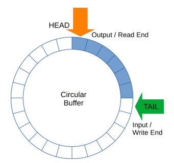

# Circular Queue

A circular queue (also called a ring buffer) is a **fixed-size** 
data structure that uses a single, **continuous block of memory** 
to implement a **queue-like behavior** with **constant time enqueue 
and dequeue** operations.

When the queue reaches the end of the array, it **wraps around** 
to the beginning, therefore the name **circular**.

* **Fixed Size**: We define the capacity up front, thus, memory usage 
    is constant.

* **Pointers/Indices**:
    - **head**: points to the next item to **dequeue**.
    - **tail**: points to the next position to **enqueue**.
    - Both wrap around when they reach the end of the array.

* **Wraparound**: Uses modular arithmetic: `(index + 1) % size`.

* **Queue States**:
    - Empty: `count == 0`
    - Full: `count == size`
    - Avoids overlapping `head` and `tail` by tracking `count`.

The **time complexity of enqueue and dequeue** of a circular 
queue is **O(1)**. 

This, together with the fixed size, makes it highly efficient in 
real-time embedded systems where we must add and remove data quickly.

## References

* [YouTube (Jacob Sorber): Implementing a Circular Queue in C](https://youtu.be/oyX30WVuEos?si=NyOK9RnJbrvnCyuR)

* [Circular Buffer](https://www.baeldung.com/cs/circular-buffer)

*Egon Teiniker, 2020-2025, GPL v3.0* 