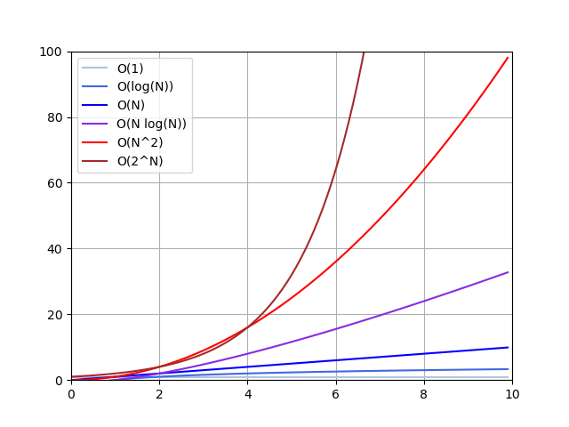

# Introduction to Data Structures & Algorithms


The term **algorithm** is used in computer science to describe a problem-solving method 
suitable for implementation as a computer program. 

Most algorithms of interest involve methods of organizing the data involved in the computation. 
Objects created in this way are called **data structures**. 

Algorithms and data structures go hand in hand.


## Implementation and Empirical Analysis

Analysis plays a role at every point in the process of designing and implementing algorithms.

We design and develop algorithms by layering **abstract operations** that help us to understand the essential nature of the computational problems that we want to solve.
In our course, we keep our feet on the ground by expressing all the algorithms that we consider in an actual **programming language: C**.

Carefully constructed **programs** in an actual programming language provide an effective means of **expressing our algorithms**.

* The first challenge that we face in empirical analysis is to **develop a correct and complete implementation**.

* The second challenge that we face in empirical analysis is to **determine the nature of the input data** and other factors that have direct influence on the experiments to be performed.

    Typically, we have three basic choices: 
    * **Actual data** enable us truly to measure the cost of the program in use

    * **Random data** assure us that our experiments test the algorithm, not the data

    * **Perverse data** assure us that our programs can handle any input presented them.

The principal danger in comparing programs empirically is that **one implementation may be coded more carefully than the other**.


## Growth of Functions

Most algorithms have a primary **parameter N** that affects the running time most significantly. The parameter N might be the degree of a polynomial, the size of a file to be sorted or searched, the number of characters in a text string, or some other abstract measure of the size of the problem being considered: it is most often directly proportional to the size of the data set being processed.

Our goal is to **express the resource requirements** of our programs (most often running time) 
**in terms of N**, using mathematical formulas that are as simple as possible and that are accurate for large values of the parameters.

Most algorithms have running times proportional to one of the following functions:

* **1** Most instructions of most programs are executed once or at most only a few times. 
    If all the instructions of a program have this property, we say that the program’s 
    running time is **constant**.

* **log N** When the running time of a program is **logarithmic**, the program gets slightly
    slower as `N` grows. This running time commonly occurs in programs that solve a big problem by transformation into a series of smaller problems, cutting the problem size by some constant fraction at each step. 
    When `N` is 1 thousand, `log N` is `3` if the base is `10`, or is about `10` if the base is `2`; when `N` is 1 million, `log N` is only double these values. 
    Whenever `N` doubles, `log N` increases by a constant, but `log N` does not double until `N` increases to `N^2`.

* **N** When the running time of a program is **linear**, it is generally the case that a 
    small amount of processing is done on each input element. 
    When `N` is 1 million, then so is the running time. 
    Whenever `N` doubles, then so does the running time. 
    This situation is optimal for an algorithm that must process `N` inputs (or produce `N` outputs).


* **N log N** The `N log N` running time arises when algorithms solve a problem by breaking it up
    into smaller subproblems, solving them independently, and then combining the solutions. For lack of a better adjective (linearithmic?), we simply say that the running time of such an algorithm is `N log N`. 
    When `N` is 1 million, `N log N` is perhaps 20 million. 
    When `N` doubles, the running time more (but not much more) than doubles.

* **N^2** When the running time of an algorithm is **quadratic**, that algorithm is practical 
    for use on only relatively small problems. Quadratic running times typically arise in algorithms that process all pairs of data items (perhaps in a double nested loop).
    When `N` is 1 thousand, the running time is 1 million. 
    Whenever `N` doubles, the running time increases fourfold. 

* **N^3** Similarly, an algorithm that processes triples of data items (perhaps in a
    triple-nested loop) has a **cubic** running time and is practical for use on only small problems. 
    When `N` is 100, the running time is 1 million. 
    Whenever `N` doubles, the running time increases eightfold.

* **2^N** Few algorithms with **exponential** running time are likely to be appropriate for
    practical use, even though such algorithms arise naturally as brute-force solutions to problems. 
    When `N` is `20`, the running time is 1 million. 
    Whenever `N` doubles, the running time squares!


## Big-O Notation

The mathematical artifact that allows us to suppress detail when we are analyzing algorithms is called the **O-notation** which is defined as follows.

Definition: **A function g(N) is said to be O(f(N)) if there exist constants c0 and N0 such 
that g(N) < c0 * f(N) for all N > N0**. 

To allow us to classify algorithms according to upper bounds on their total running times, we use the O-notation for three distinct purposes: 
* To bound the error that we make when we ignore small terms in mathematical formulas. 
* To bound the error that we make when we ignore parts of a program that contribute a small amount to the total being analyzed.
* To allow us to **classify algorithms** according to upper bounds on their total running times.

The O-notation allows us to keep track of the leading terms while **ignoring smaller terms when manipulating approximate mathematical expressions**, and ultimately allows us to make concise statements that give accurate approximations to the quantities that we analyze.
The O-notation provides us with a way to get an **approximate answer for large N** without bothering with such terms.



Studying the **worst-case performance of algorithms** is attractive because it allows us to make guarantees about the running time of programs. We say that the number of times certain abstract operations are executed is less than a certain function of the number of inputs, no matter what the input values are.

Programs with good worst-case performance characteristics are a basic goal in algorithm design.

Worst-case analysis using the O-notation **frees the analyst from considering the details of particular machine characteristics**.
We ignore constant factors in the analysis; in most cases, if we want to know whether the running time of an algorithm is proportional to N or proportional to log N, it does not matter whether the algorithm is to be run on a microcontroller or on a supercomputer, and it does not matter whether the inner loop has been implemented carefully with only a few instructions or badly implemented with many instructions.


## Examples of Algorithm Analysis

### Sequential Search
We store all the objects in an **array**; then, for each transaction, we look through 
the array sequentially, from beginning to end, checking each to see whether it is the 
one that we seek.

```C
int search(int data[], int size, int value)
{
    for(int i=0; i<size; i++)
    {
        if(data[i] == value)
        {
            return i;
        }
    }
    return -1;
}
```

We can determine that the search is unsuccessful only by examining each of the `N` objects, but a search could end successfully at the first, second, or any one of the objects.

The best guarantee that we can provide is that **no more that N numbers will be examined**.

To make a prediction, however, we need to make an assumption about the data. In this case, we might choose to assume that all the numbers are randomly chosen.

*Property: Sequential search examines `N` numbers for each unsuccessful search and 
about `N/2` numbers for each successful search on the average.*

This implies that the running time of the program is proportional to `N`, subject to the implicit assumption that the average cost of comparing two numbers is constant.

*Property: Sequential search in an ordered table examines `N` numbers for each search in the worst case and about `N/2` numbers for each search on the average.*

Therefore, the runtime complexity of the sequential search algorithm is **O(N)**. 


## References

* [YouTube: What Is Big O Notation?](https://youtu.be/Q_1M2JaijjQ)

* Robert Sedgewick. **Algorithms in C, Parts 1-4: Fundamentals, Data Structures, Sorting, Searching**. Pearson Education, 1998 
    * Chapter 1: Introduction
    * Chapter 2: Principles of Algorithm Analysis


*Egon Teiniker, 2020-2022, GPL v3.0*    
