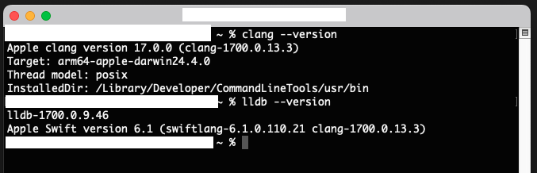
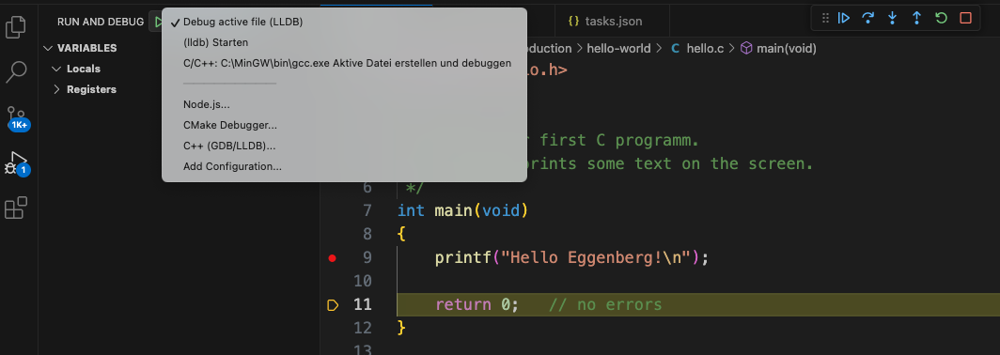

# VS Code Setup for C/C++ Development on macOS

This guide will walk you through setting up a clean and reliable C/C++ development environment using **Visual Studio Code (VS Code)** on **macOS**, including automatic building, debugging. This setup uses only open-source components.

## 1. Install Visual Studio Code

### Install via Official Website
- Visit [https://code.visualstudio.com/](https://code.visualstudio.com/)
- Download and install the `.zip` file
- Move **Visual Studio Code.app** to `/Applications`

## 2. Install Command Line Tools (Clang)

Clang is preinstalled on most macOS systems. To ensure the toolchain is correctly installed, enter the following to your terminal:
```bash
xcode-select --install
```
This installs:
- `clang` (C/C++ compiler)
- `lldb` (debugger)
- basic Unix build tools

> !! You **do not** need the full Xcode app !!

To verify:
```bash
clang --version
lldb --version
```


## 3. Install Required Extensions in VS Code

Open **Extensions** (`CMD+SHIFT+X`) and search for:

1. **C/C++** (by Microsoft)
   - Provides IntelliSense, debugging, and browsing features
   - ID: `ms-vscode.cpptools`

2. **Code Runner** (optional, for quick runs)
   - Allows executing code with a hotkey (`CMD+OPTION+N`)
   - ID: `formulahendry.code-runner`

## 4. Project Configuration (Tasks and Debugging)

To enable automated compilation and debugging, two configuration files are needed:

### `.vscode/tasks.json`
Builds the currently active C file using Clang:
```json
{
  "version": "2.0.0",
  "tasks": [
    {
      "label": "build active file",
      "type": "shell",
      "command": "clang",
      "args": [
        "-g",
        "${file}",
        "-o",
        "${fileDirname}/${fileBasenameNoExtension}"
      ],
      "group": {
        "kind": "build",
        "isDefault": true
      },
      "problemMatcher": ["$gcc"]
    }
  ]
}
```

### `.vscode/launch.json`
Debugs the binary compiled from the current file:
```json
{
  "version": "0.2.0",
  "configurations": [
    {
      "name": "Debug active file (LLDB)",
      "type": "cppdbg",
      "request": "launch",
      "program": "${fileDirname}/${fileBasenameNoExtension}",
      "args": [],
      "stopAtEntry": true,
      "cwd": "${fileDirname}",
      "environment": [],
      "externalConsole": false,
      "MIMode": "lldb",
      "preLaunchTask": "build active file"
    }
  ]
}
```

### Why this is necessary:
- **tasks.json** tells VS Code how to compile your code automatically using Clang.
- **launch.json** tells VS Code how to debug your program using LLDB, linked to the current file.
- `${file}`-based variables ensure flexibility: works with any `.c` file, not just `main.c`.




*Florian Mayer, 2020-2025, GPL v3.0*   