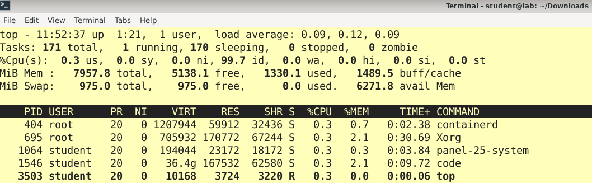

# Working with Processes and Threads

A **process** is a computer program under execution. 
Linux is running many processes at any given time. 

With a **process ID (PID)**, we can identify any process in Linux. 
Internally, the kernel uniquely allocates this number and releases it for reuse 
after the process exits.

Since many processes are running at any given time in Linux, they have 
to share the CPU. The process of switching between two executing processes 
on the CPU is called process **context switching**. 
Process context switching is expensive because the kernel has to save old 
registers and load current registers, memory maps, and other resources.

## Listing Processes
For a quick listing of running processes, we run the command `ps`.
```
$ ps
    PID TTY          TIME CMD
   1680 pts/2    00:00:00 bash
   2670 pts/2    00:00:00 ps 
```
The fields are as follows:
* **PID** The process ID.
* **TTY** The terminal device where the process is running.
* **TIME** The amount of CPU time in minutes and seconds that the program has used so far.
* **CMD** Name of the running process.

The `ps` command has many options:
* `ps x` Show all of our running processes
* `ps ax` Show all processes running on the system
* `ps u` Include more detailed information on processes
* `ps w` Show full command names

To see the hierarchy of running processes type:
```
$ ps --forest
    PID TTY          TIME CMD
   1875 pts/1    00:00:00 bash
   3293 pts/1    00:00:00  \_ ps
```

A more appealing presentation can be obtained with:
``` 
$ pstree -p
...
└─xfce4-terminal(1870)───bash(1875)───pstree(3400)
```
* `p` Include process IDs 

To see a **dynamic real-time view** of a running system, we use the `top` command:


The columns are labeled:
* `PID`: Shows task’s unique process ID.
* `USER`: User name of owner of task.
* `PR`: Stands for priority of the task.
* `NI`: Represents a Nice Value of task. A negative nice value implies higher priority, and positive nice value means lower priority.
* `VIRT`: Total virtual memory used by the task.
* `RES`: Represents the amount of actual physical memory a process is consuming.
* `SHR`: Represents the Shared Memory size (kb) used by a task.
* `S`: The state the process is in (R=running, S=sleeping, I=idle, T=stopped, z=zombie).
* `%CPU`: Represents the CPU usage.
* `%MEM`: Shows the Memory usage of task.
* `TIME+`: CPU Time, the same as ‘TIME,’ but reflecting more granularity through hundredths of a second.
* `COMMAND`: The command that is being run.

### Killing Processes
To terminate a process, we send a **signal** with the `kill` command.
A singnal is a message to a process from the kernel.
```
$ kill pid
```
There are many types of signals:
* `-TERM` Terminate the process (default)
* `-STOP` Freeze a process. A stopped process is still in memory. 
* `-CONT` Continue running.
* `-KILL` While other signals give the process a chance to clean up after itself, `KILL` does not. 
Note that using `CTRL-C` to terminate a process that is running in the current terminal is 
the same as using kill to end the process with the `-INT` (interrupt) signal. 


## Background Processes
Normally, when we run a command from the shell, we don't get the shell prompt back until the 
program finishes executing.

We can detach a process from the shell and put it in the background using the `&` operator.
The shell should respond by printing the PID of the new background process, and the prompt 
should return immediately so that we can continue working.
The process will continue to run after we log out.

## Listing Threads

A thread is a **lightweight process**. A process can do more than one unit of work 
concurrently by creating one or more threads. These threads, being lightweight, 
can be spawned quickly.

Let’s see an example and identify the process and its thread in Linux using the 
following command:
```
$ ps -eLf
UID          PID    PPID     LWP  C NLWP STIME TTY          TIME CMD
root           1       0       1  0    1 10:30 ?        00:00:01 /sbin/init
root           2       0       2  0    1 10:30 ?        00:00:00 [kthreadd]
root           3       2       3  0    1 10:30 ?        00:00:00 [rcu_gp]
root           4       2       4  0    1 10:30 ?        00:00:00 [rcu_par_gp]
...
student     1280     953    1280  0   30 10:31 ?        00:00:13 /usr/share/code/code --unity-launch --enable-crashpad
...
```
* `PID`: Unique process identifier
* `PPID`: Parent process ID 
* `LWP`: **Unique thread identifier** inside a process
* `NLWP`: **Number of threads** for a given process

We can easily identify **single-threaded** and **multi-threaded processes** by their NLWP values. 
* Single-threaded processes have the same PID and LWP values as if they are the same thing. 

* In a multi-threaded process, only one LWP matches its PID, and the others have different values of LWP. 

Also, note that the value, once assigned to an LWP, is never given to another process.

## References

*[Linux Process vs. Thread](https://www.baeldung.com/linux/process-vs-thread)

*Egon Teiniker, 2020-2023, GPL v3.0* 