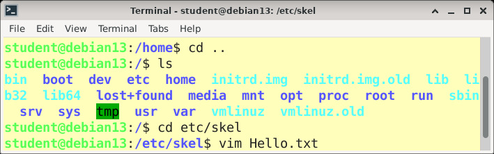
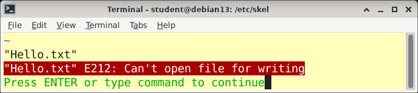
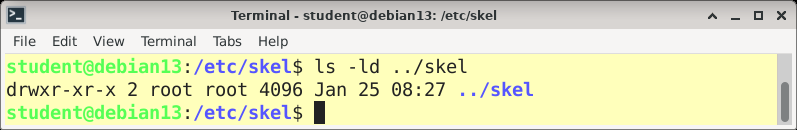
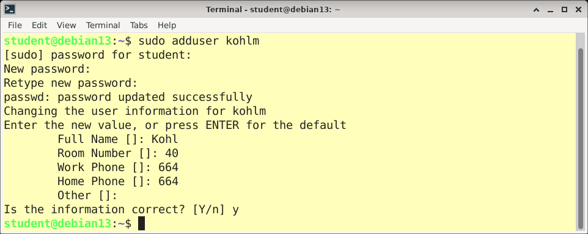
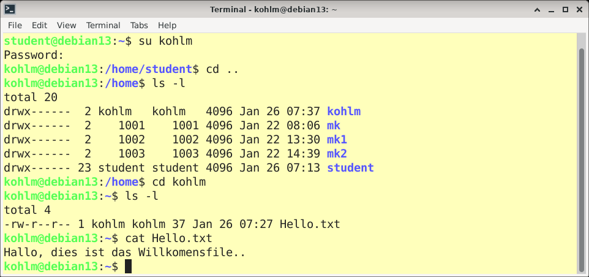
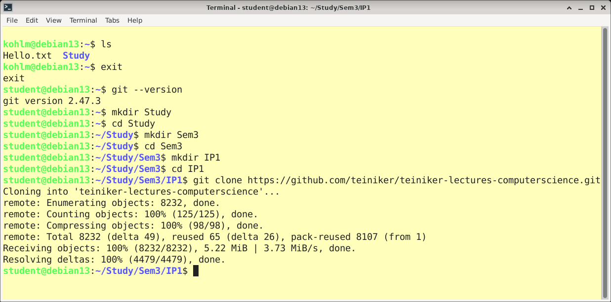
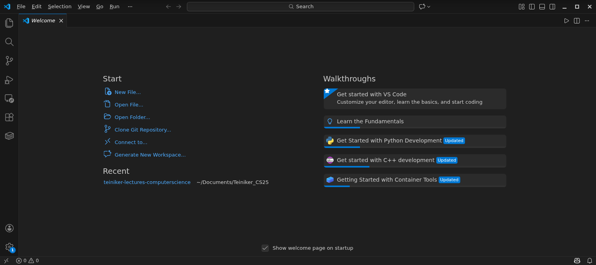
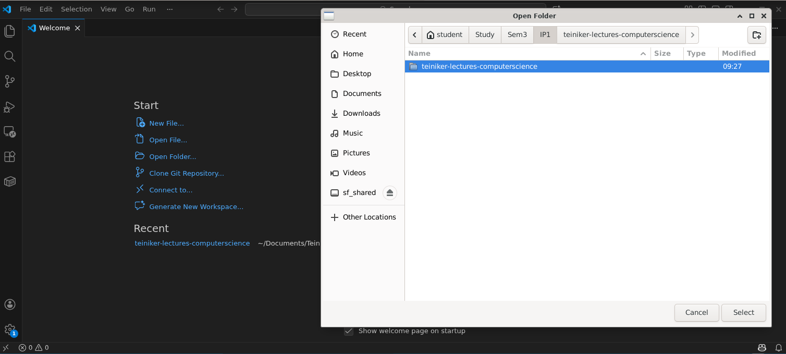
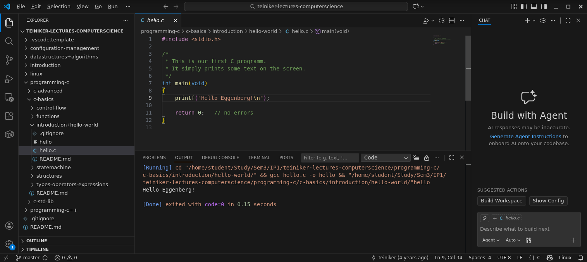

# Aufgabenstellung IP1 Lab12: LINUX
Nach dem Installieren der VirtualBox und einrichten der Linux Umgebung starten sie die Linux Umgebung:
* Background: [Setup Linux](https://github.com/teiniker/teiniker-lectures-computerscience/blob/master/introduction/setup/Environment-Linux.md)

## Starten sie ein Terminal (bash) als User (student)
* Background: [Arbeiten im Dateisystem](https://github.com/teiniker/teiniker-lectures-computerscience/blob/master/linux/filesystem/FileSystemCommands.md)
  
## Erstellen sie ein neues File in `/etc/skel` mit dem Namen  `Hello.txt`.
  * Editieren sie dieses File mit dem Editor `vim`:  `vim Hello.txt`
  * Einfügen des Texts: `Hallo, dies ist das Willkommensfile..`
  * Speichern und Editor beenden
  * Background: [vim als Editor](https://github.com/teiniker/teiniker-lectures-computerscience/blob/master/linux/editors/vim.md)

Als `student` hat man keine Schreibrechte in `/etc/skel`.

Daher verlassen wir den Editor mit `:q!`.

Lösung: Wechseln des Benutzers oder `sudo` (mit den Rechten des `root` Benutzers) und erneuter Versuch das File zu erstellen.

## Legen sie einen neuen Benutzer an (`Nachname_Vorname`)
* Background: [Benutzerverwaltung](https://github.com/teiniker/teiniker-lectures-computerscience/tree/master/linux/user-management)
  

* Wechseln sie zum neuen User
* Welches File finden sie im `/home/Nachname_Vorname` Verzeichnis
* Ausgabe des Fileinhaltes mittels `cat Hallo.txt`

## Clonen des Repositories:
* Wechseln sie wieder zum Benutzer `student`
* Erstellen sie das Verzeichnis `/home/student/Study/Sem1/IP1`
* Clonen sie `https://github.com/teiniker/teiniker-lectures-computerscience.git` in dieses Verzeichnis (einfügen der Zwischenablage mittels `Strg + Shift + V`)

  
## Compilieren und ausführen in Visual Studio Code:
* Starten sie VS Code

* File -> Open Folder

* Yes, I trust the autors
* Öffnen eines bestehenden *.c; Run code...

Debian/linux intro done!

*Martin Kohl, 2026-2026, GPL v3.0* 