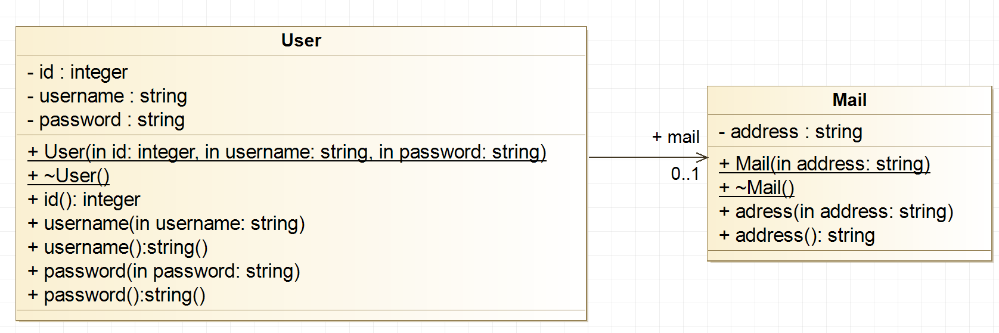

# Example: Directed Association - User and Mail

A **directed association** is a relationship between two classes where one
class holds a reference to another class, but not vice versa. 

In this example, the `User` class is associated with the `Mail` class: 
a user **"has a"** mail address. The association is directed from `User` 
to `Mail`,meaning `User` knows about `Mail`, but `Mail` has no knowledge 
of `User`.

The **"has a"** relationship indicates that one object contains a reference
to another independently existing object. Unlike composition, the referenced
object is not owned by the containing class: the `Mail` object is created
and destroyed separately from the `User` object, and the caller is
responsible for memory management.



In UML, a directed association is shown with an open arrowhead pointing
from the source class to the target class, annotated with multiplicity
(here `[1]`).


## Implementation

The association is realized by storing a **raw pointer** to the associated
object as a private member of the source class.

### Mail Class

The `Mail` class holds a single email address:

```C++
class Mail
{
    private:
        std::string _address;

    public:
        Mail(const std::string& address);

        std::string address() const;
        void address(const std::string& address);
};
```

* **Constructor**: Initializes `_address` via an initializer list.
* **Getter**: Returns the stored address by value (a copy), so the caller
    cannot accidentally modify the internal state.
* **Setter**: Replaces the stored address with a new value.


### User Class

The `User` class stores credentials and holds a pointer to a `Mail` object,
representing the directed association:

```C++
class User
{
    private:
        int _id;
        std::string _username;
        std::string _password;
        Mail* _mail;            // ---[1]-> Mail

    public:
        User(const int id, const std::string& username,
             const std::string& password, Mail* mail);

        int id(void) const;
        void id(const int id);

        std::string username(void) const;
        void username(const std::string& username);

        std::string password() const;
        void password(const std::string& password);

        // ---[1]-> Mail
        Mail* mail(void) const;
        void mail(Mail* mail);
};
```

* **Association Member**: `Mail* _mail` stores a raw pointer to an
    externally managed `Mail` object.

* **Pointer Getter/Setter**: `mail()` returns the raw pointer, enabling
    navigation from a `User` to its associated `Mail` object.

* **Memory Ownership**: The `User` class does not own the `Mail` object.
    The client code is responsible for creating and deleting it.


### Navigation

Because the association is directed, navigation is only possible in one
direction: from `User` to `Mail`. Given a `User` object, the associated
`Mail` object is reached through the `mail()` getter:

```C++
Mail* mail = new Mail("homer.simpson@springfield.com");
User* user = new User(7, "homer", "c3R1ZGVudA", mail);

// Navigation: User -> Mail
std::string address = user->mail()->address();

delete user;
delete mail;
```

The reverse navigation (from `Mail` to `User`) is not possible because
`Mail` holds no reference back to `User`.


## Test Cases

The Unity test file verifies both classes and the association navigation.
The `setUp()` function creates a `Mail` and a `User` object before each
test, and `tearDown()` deletes them afterwards.

**test_user_constructor**: Verifies that the `User` is initialized with
the correct `id`, `username`, and `password`.

```C++
void test_user_constructor(void)
{
    TEST_ASSERT_EQUAL(7, user->id());
    TEST_ASSERT_EQUAL_STRING("homer", user->username().c_str());
    TEST_ASSERT_EQUAL_STRING("c3R1ZGVudA", user->password().c_str());
}
```

**test_mail_constructor**: Verifies that the `Mail` object stores the
correct email address.

```C++
void test_mail_constructor(void)
{
    TEST_ASSERT_EQUAL_STRING("homer.simpson@springfield.com",
        mail->address().c_str());
}
```

**test_navigation**: Verifies that traversal from `User` to `Mail` via
the `mail()` pointer works correctly.

```C++
void test_navigation(void)
{
    TEST_ASSERT_EQUAL_STRING("homer.simpson@springfield.com",
        user->mail()->address().c_str());
}
```

*Egon Teiniker, 2020-2026, GPL v3.0*
