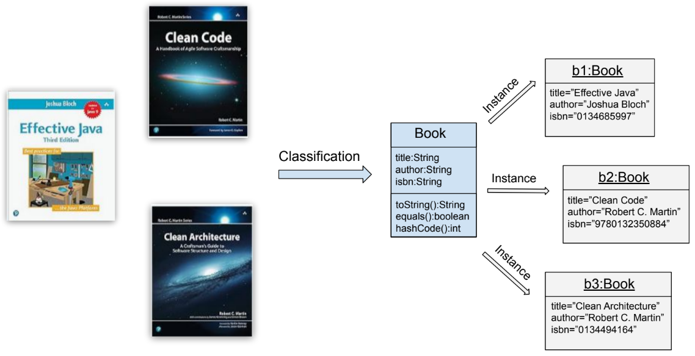

# Object-Oriented Programming Concepts 

**Object-oriented programming (OOP)** is a programming paradigm based on the concept 
of **objects**, which can contain data in the form of **fields** (often known as 
attributes or properties) and code, in the form of **operations** (often known as methods). 
OOP languages enable programmers to create modular, reusable software components.

In object-oriented programming we try to **recreate real objects virtually**. The most 
important properties and functionalities of real objects are **classified**. From this 
abstraction we can implement a **class** that represents a new type. 
**Instances of this class** can then replicate real objects by storing their concrete 
properties.

