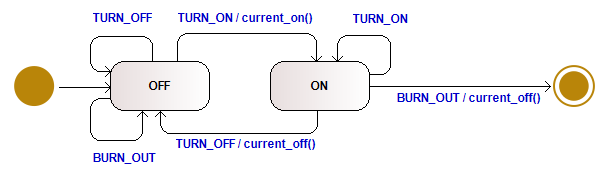
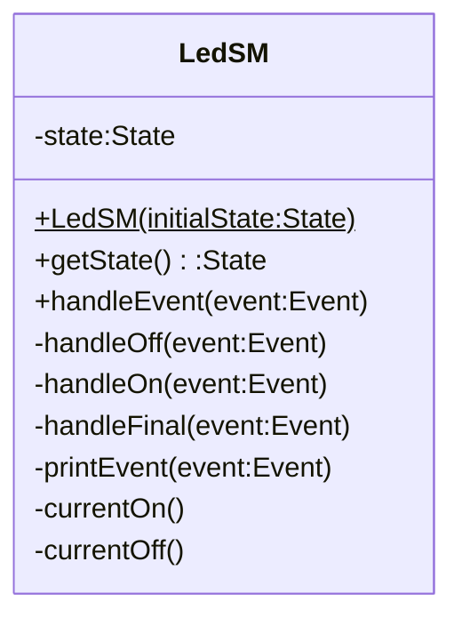

# Example: State Machine - Led

This example implements the LED state machine, known from
`datastructures+algorithms/algorithms/control/statemachine/sm-led`,
as a C++ class named `LedSM`. Instead of a free function operating
on a global variable, the state is kept as a private member of the
class.



### States

| State   | Description                          |
|---------|---------------------------------------|
| `OFF`   | LED is off, ready to use             |
| `ON`    | LED is on and consuming current      |
| `FINAL` | Terminal state, LED has burned out   |

### Events (Triggers)

| Event      | Description                   |
|------------|--------------------------------|
| `TURN_ON`  | Request to switch the LED on  |
| `TURN_OFF` | Request to switch the LED off |
| `BURN_OUT` | LED filament failure          |


### Transitions and Actions

| Current State  | Event      | Next State | Action         |
|----------------|------------|------------|----------------|
| `OFF`          | `TURN_ON`  | `ON`       | `currentOn()`  |
| `ON`           | `TURN_OFF` | `OFF`      | `currentOff()` |
| `ON`           | `BURN_OUT` | `FINAL`    | `currentOff()` |

All other event and state combinations are ignored, e.g. `TURN_ON`
while already `ON`, or any event while in `FINAL`. These are self
loops without action.


## Implementation

`LedSM` encapsulates the state machine in a class.



The current state, `_state`, and every helper method are `private`.
Only the constructor, `getState()`, and `handleEvent()` are `public`.
Callers can query the state or send an event, but they cannot reach
into the object and change `_state` directly, or call a handler out
of turn. In the C version, `state` was an `extern` global that any
translation unit could read or overwrite.

```cpp
class LedSM
{
public:
    LedSM(State initialState = OFF);

    State getState(void) const;
    void  handleEvent(Event event);

private:
    State _state;

    void handleOff(Event event);
    void handleOn(Event event);
    void handleFinal(Event event);

    void currentOn(void);
    void currentOff(void);
    void printEvent(Event event);
};
```

`handleEvent()` is the single entry point. It dispatches to a
private handler method based on the current state, mirroring the
`switch` on `state` in the C dispatcher, but the handlers can only
be reached through `handleEvent()`:

```cpp
void LedSM::handleEvent(Event event)
{
    printEvent(event);

    switch(_state)
    {
        case OFF:
            handleOff(event);
            break;

        case ON:
            handleOn(event);
            break;

        case FINAL:
            handleFinal(event);
            break;
    }
}
```


## Test Cases

* Each test in `test.cpp` gets a fresh `LedSM` instance from `setUp()`
    and destroys it in `tearDown()`, so tests never share state:

    ```cpp
    void setUp(void)
    {
        led = new LedSM();
    }

    void tearDown(void)
    {
        delete led;
        led = NULL;
    }
    ```

* `test_turn_on_then_off()`: Drives the object through a normal cycle
    and checks that it returns to `OFF`:

    ```cpp
    void test_turn_on_then_off(void)
    {
        led->handleEvent(LedSM::TURN_ON);
        led->handleEvent(LedSM::TURN_OFF);
        TEST_ASSERT_EQUAL(LedSM::OFF, led->getState());
    }
    ```

* `test_final_state_is_terminal()`: Checks the invariant that, once the
    LED has burned out, no further event can move it out of `FINAL`:

    ```cpp
    void test_final_state_is_terminal(void)
    {
        led->handleEvent(LedSM::TURN_ON);
        led->handleEvent(LedSM::BURN_OUT);

        led->handleEvent(LedSM::TURN_ON);
        led->handleEvent(LedSM::TURN_OFF);
        led->handleEvent(LedSM::BURN_OUT);

        TEST_ASSERT_EQUAL(LedSM::FINAL, led->getState());
    }
    ```

The remaining tests cover the ignored events in `OFF`, the
`TURN_ON` self loop in `ON`, and construction with an explicit
initial state via `LedSM(LedSM::ON)`.


*Egon Teiniker, 2020-2026, GPL v3.0*
