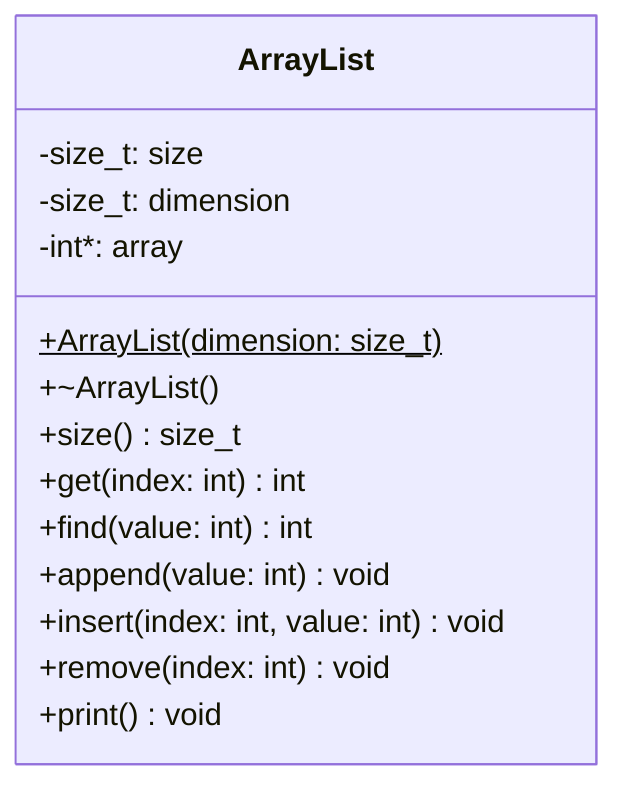

# Example: ArrayList 

An `ArrayList` stores elements in a contiguous block of memory (a dynamic
array). Compared to a linked list, the key benefits are:

* **O(1) random access**: any element is reached directly via its index
    without traversal.
* **Better cache performance**: contiguous memory layout means elements
    are loaded together into CPU cache lines, making iteration faster.
* **Lower memory overhead**: no per-node pointers are needed; only the
    array itself and two bookkeeping integers are stored.

The trade-off is that `insert` and `remove` require shifting elements,
which is O(n) in the worst case -- the same as a linked list for those
operations, but with higher constant cost due to the shifts.


## Class Diagram




## Implementation

`ArrayList` is a facade class that wraps a raw heap-allocated array and
exposes a list interface. Two bookkeeping members track state:

* `dimension`: the maximum number of elements the array can hold
    (fixed at construction time).
* `size`: the number of elements currently stored.

The constructor allocates the array on the heap and zero-initialises it:

```cpp
ArrayList::ArrayList(size_t dimension)
{
    _size = 0;
    _dimension = dimension;
    _array = new int[dimension]();
}
```

The destructor releases the heap memory, preventing a resource leak:

```cpp
ArrayList::~ArrayList()
{
    delete[] _array;
}
```

**Random access** (`get`) returns the element at a given index after a
bounds check:

```cpp
int ArrayList::get(int index)
{
    if (index < 0 || index >= (int)_size)
    {
        fprintf(stderr, "Index out of bounds\n");
        exit(EXIT_FAILURE);
    }
    return _array[index];
}
```

**Insertion** (`insert`) shifts all elements from `index` onwards one
position to the right to open a slot, then writes the new value:

```cpp
void ArrayList::insert(int index, int value)
{
    for (int i = (int)_size; i > index; i--)
    {
        _array[i] = _array[i - 1];
    }
    _array[index] = value;
    _size++;
}
```

**Removal** (`remove`) shifts all elements after `index` one position
to the left to close the gap:

```cpp
void ArrayList::remove(int index)
{
    _size--;
    for (int i = index; i < (int)_size; i++)
    {
        _array[i] = _array[i + 1];
    }
}
```


*Egon Teiniker, 2020-2026, GPL v3.0*