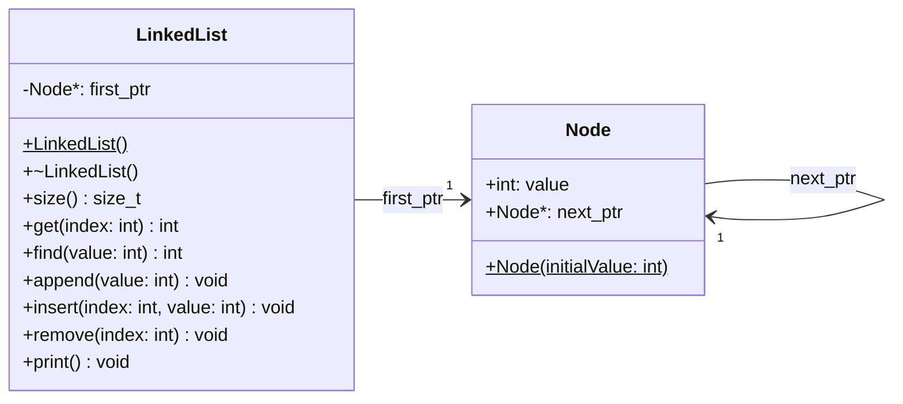

# Example: Linked-List 

A **linked list** stores elements in dynamically allocated nodes, each
holding a value and a pointer to the next node. Compared to an array-based
list, the key benefits are:

* **O(1) insert and remove at the head**: no elements need to be shifted;
    only a pointer is updated.

* **No pre-allocated capacity**: memory is allocated per node on demand,
    so the list grows and shrinks without wasting space.

* **No contiguous memory required**: large lists can be built even when
    no single free block of the required size is available.

The trade-off is O(n) random access: reaching element at index `i`
requires traversing `i` nodes from the head.


## Class Diagram




## Implementation

`LinkedList` is a facade class that owns a chain of `Node` objects.
`Node` is a simple struct with a value and a pointer to the next node:

```cpp
struct Node
{
    Node(int initialValue)
    {
        value = initialValue;
        next_ptr = NULL;
    }

    int value;
    Node *next_ptr;
};
```

`LinkedList` keeps only a single pointer `first_ptr` to the head of the
chain. The constructor initialises it to `NULL` (empty list):

```cpp
LinkedList::LinkedList()
{
    first_ptr = NULL;
}
```

The destructor walks the chain and deletes every node to prevent memory
leaks:

```cpp
LinkedList::~LinkedList()
{
    Node *ptr = first_ptr;
    while(ptr->next_ptr != NULL)
    {
        Node *rm = ptr;
        ptr = ptr->next_ptr;
        delete(rm);
    }
    delete(ptr);
}
```

**Append** traverses to the last node and links a new node after it. If
the list is empty, the new node becomes the head:

```cpp
void LinkedList::append(int value)
{
    if(first_ptr == NULL)
    {
        first_ptr = new Node(value);
    }
    else
    {
        Node *ptr = first_ptr;
        while(ptr->next_ptr != NULL)
        {
            ptr = ptr->next_ptr;
        }
        ptr->next_ptr = new Node(value);
    }
}
```

**Insert** at position `index` allocates a new node, then splices it in
by updating the predecessor's `next_ptr`. Inserting at index 0 (the
head) is handled as a special case:

```cpp
void LinkedList::insert(int index, int value)
{
    Node *ptr = new Node(value);

    if (index == 0)
    {
        ptr->next_ptr = first_ptr;
        first_ptr = ptr;
    }
    else
    {
        Node *prev = first_ptr;
        for (int i = 0; i < index - 1; i++)
        {
            prev = prev->next_ptr;
        }
        ptr->next_ptr = prev->next_ptr;
        prev->next_ptr = ptr;
    }
}
```

**Remove** at position `index` unlinks the target node by connecting its
predecessor directly to its successor, then deletes the node. Removing
the head is again a special case:

```cpp
void LinkedList::remove(int index)
{
    if (index == 0)
    {
        Node *rm = first_ptr;
        first_ptr = first_ptr->next_ptr;
        delete rm;
    }
    else
    {
        Node *prev = first_ptr;
        for (int i = 0; i < index - 1; i++)
        {
            prev = prev->next_ptr;
        }
        Node *rm = prev->next_ptr;
        prev->next_ptr = rm->next_ptr;
        delete rm;
    }
}
```


*Egon Teiniker, 2020-2026, GPL v3.0*