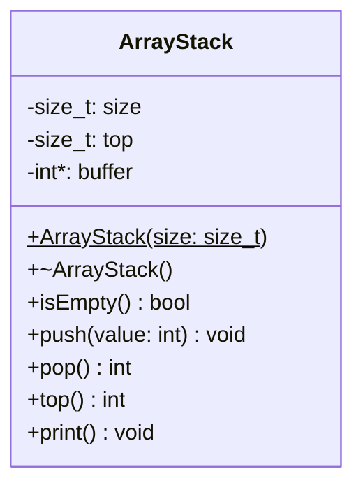

# Example: ArrayStack 

An **ArrayStack** implements the stack data structure using a fixed-size
heap-allocated array. Compared to a linked-list-based stack, the benefits
are:

* **O(1) push and pop**: only an index is incremented or decremented; no
    heap allocation happens per operation.

* **Better cache performance**: all elements reside in contiguous memory,
    so repeated access is CPU-cache-friendly.

* **Lower per-element overhead**: no per-node pointer is stored alongside
    each value.

The trade-off is a fixed capacity that must be known at construction time.


## Class Diagram




## Implementation

`ArrayStack` wraps a heap-allocated integer array. Three private members
track state:

* `size`: the maximum number of elements (fixed at construction).

* `top`: index of the current top element; `0` means the stack is empty.

* `buffer`: the heap-allocated array; valid elements occupy indices `1..top`.

The constructor allocates the buffer and initialises `top` to `0`:

```cpp
ArrayStack::ArrayStack(size_t size)
{
    _size = size;
    _top  = 0;
    _buffer = new int[size];
}
```

The destructor releases the buffer to prevent a resource leak:

```cpp
ArrayStack::~ArrayStack()
{
    delete[] _buffer;
}
```

**push** increments `_top` and writes the value at that position.
When `_top` reaches `_size - 1` the buffer is full and the call is
silently ignored:

```cpp
void ArrayStack::push(int value)
{
    if (_top == _size - 1)
        return;

    _top++;
    _buffer[_top] = value;
}
```

**pop** reads the top value via `top()`, decrements `_top`, and returns
the value. If the stack is empty it returns `EXIT_FAILURE`:

```cpp
int ArrayStack::pop()
{
    if (isEmpty())
        return EXIT_FAILURE;

    int value = top();
    _top--;
    return value;
}
```

**top** returns the element at `_buffer[_top]` without removing it:

```cpp
int ArrayStack::top()
{
    if (isEmpty())
        return EXIT_FAILURE;

    return _buffer[_top];
}
```


## Test Cases

A global `ArrayStack` pointer is created in `setUp` (capacity 10, with
values 1, 3, 5 already pushed) and deleted in `tearDown`.

**test_is_not_empty**: verifies that a stack with elements reports
`isEmpty() == false`.

**test_is_empty**: pops all three elements and checks that the stack then
reports `isEmpty() == true`.

**test_pop**: verifies that elements are returned in LIFO order -- 5,
then 3, then 1:

```cpp
void test_pop(void)
{
    TEST_ASSERT_EQUAL(5, stack->pop());
    TEST_ASSERT_EQUAL(3, stack->pop());
    TEST_ASSERT_EQUAL(1, stack->pop());
}
```

**test_top**: verifies that `top()` returns the top value without
removing it -- two consecutive calls both return 5:

```cpp
void test_top(void)
{
    TEST_ASSERT_EQUAL(5, stack->top());
    TEST_ASSERT_EQUAL(5, stack->top());
}
```


*Egon Teiniker, 2020-2026, GPL v3.0*