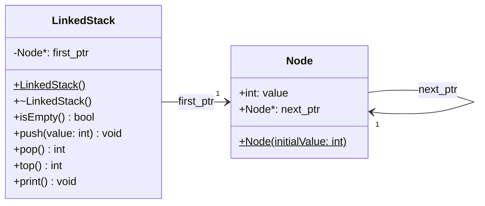

# Example: LinkedStack 

A **LinkedStack** implements the stack data structure using a singly-linked
list of heap-allocated nodes. Compared to an array-based stack, the
benefits are:

* **Unbounded capacity**: nodes are allocated on demand, so the stack
    grows as long as heap memory is available -- no capacity must be
    declared upfront.

* **No wasted memory**: only as many nodes as there are elements are
    allocated; there is no unused buffer space.

* **O(1) push and pop**: prepending and removing the head node requires
    only pointer updates, with no shifting.

The trade-off is a small per-element overhead for the `next_ptr` pointer
stored in every node, and one heap allocation per `push` operation.


## Class Diagram




## Implementation

`LinkedStack` keeps a single pointer `first_ptr` to the head node, which
represents the top of the stack. `Node` is a simple struct holding a
value and a pointer to the next node:

```cpp
struct Node
{
    Node(int initialValue)
    {
        value = initialValue;
        next_ptr = NULL;
    }

    int   value;
    Node *next_ptr;
};
```

The constructor initialises `first_ptr` to `NULL` (empty stack):

```cpp
LinkedStack::LinkedStack()
{
    first_ptr = NULL;
}
```

The destructor repeatedly calls `pop()` until the stack is empty,
freeing every node:

```cpp
LinkedStack::~LinkedStack()
{
    while (!isEmpty())
        pop();
}
```

**push** allocates a new node, links it to the current head, and makes
it the new head -- a prepend operation:

```cpp
void LinkedStack::push(int value)
{
    Node *ptr = new Node(value);
    ptr->next_ptr = first_ptr;
    first_ptr = ptr;
}
```

**pop** saves the head node's value, advances `first_ptr` to the next
node, deletes the old head, and returns the saved value:

```cpp
int LinkedStack::pop()
{
    Node *ptr = first_ptr;
    int value = ptr->value;
    first_ptr = ptr->next_ptr;
    delete ptr;
    return value;
}
```

**top** returns the value of the head node without removing it:

```cpp
int LinkedStack::top()
{
    return first_ptr->value;
}
```


## Test Cases

A global `LinkedStack` pointer is created in `setUp` (values 1, 3, 5
pushed in that order) and deleted in `tearDown`.

**test_is_not_empty**: verifies that a stack with elements reports
`isEmpty() == false`.

**test_is_empty**: pops all three elements and checks that the stack
then reports `isEmpty() == true`.

**test_pop**: verifies LIFO order -- 5 is returned first, then 3,
then 1:

```cpp
void test_pop(void)
{
    TEST_ASSERT_EQUAL(5, stack->pop());
    TEST_ASSERT_EQUAL(3, stack->pop());
    TEST_ASSERT_EQUAL(1, stack->pop());
}
```

**test_top**: verifies that `top()` returns the top value without
removing it -- two consecutive calls both return 5:

```cpp
void test_top(void)
{
    TEST_ASSERT_EQUAL(5, stack->top());
    TEST_ASSERT_EQUAL(5, stack->top());
}
```

*Egon Teiniker, 2020-2026, GPL v3.0*
