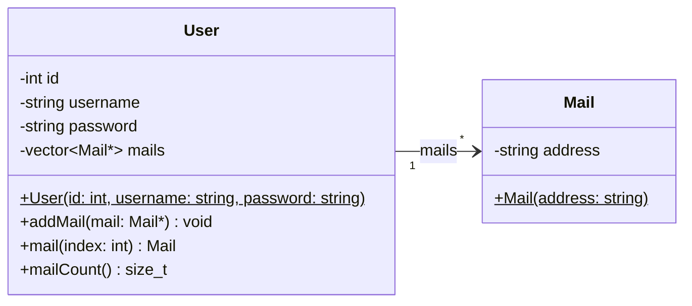

# Example: One-To-Many Association 

A **directed association of multiplicity `*`** means that one object (`User`)
holds references to **zero or more** objects of another class (`Mail`).

The direction of the arrow indicates that `User` knows about `Mail`, but `Mail`
has no knowledge of `User`. The associated objects are managed externally -
`User` does not own them, so it is not responsible for their creation or
destruction.

## Class Diagram 



## Implementation

The association is implemented in `User` using a `std::vector` of raw pointers
to `Mail` objects:

```cpp
// user.h
std::vector<Mail*> _mails;      // ---[*]-> Mail

void   addMail(Mail* mail);
Mail*  mail(int index) const;
size_t mailCount() const;
```

* `addMail()` appends a pointer to an existing `Mail` object into the vector.

* `mail(index)` returns the pointer at the given position, and `mailCount()`
    returns the number of stored references:

```cpp
// user.cpp
void User::addMail(Mail* mail)
{
    _mails.push_back(mail);
}

Mail* User::mail(int index) const
{
    return _mails[index];
}

size_t User::mailCount() const
{
    return _mails.size();
}
```

Because raw pointers are stored, `User` does **not** own the `Mail` objects.
The caller is responsible for allocating and deleting them.


*Egon Teiniker, 2020-2026, GPL v3.0*