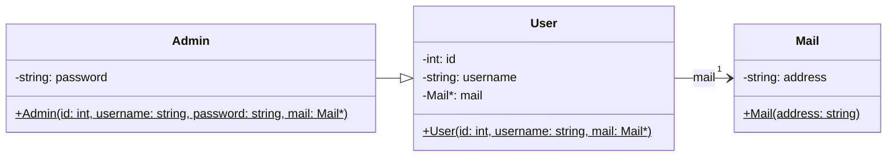

# Example: Inheritance - User, Admin and Mail

**Inheritance** is a mechanism that allows one class (the **derived class**)
to acquire the members of another class (the **base class**). The derived
class extends the base class by adding new data members or methods.

The relationship between a derived class and its base class is described as
**"is a"**: an `Admin` IS a `User`. This means an `Admin` object can be used
wherever a `User` object is expected, which enables **polymorphism**: a
`User*` pointer can point to an `Admin` object, and shared behaviour is
accessed uniformly through the base class interface.


## Class Diagram



In the class diagram, inheritance is shown with a solid line and a hollow
arrowhead pointing from the derived class (`Admin`) to the base class
(`User`). `Admin` inherits all public members of `User` and adds the
private `password` attribute.


## Implementation

### User Class (Base Class)

`User` is the base class that stores an id, a username, and a pointer to
a `Mail` object:

```C++
class User
{
    private:
        int _id;
        std::string _username;
        Mail* _mail;

    public:
        User(const int id, const std::string& username, Mail* mail);

        int id() const;
        void id(const int id);

        std::string username(void) const;
        void username(const std::string& username);

        Mail* mail() const;
        void mail(Mail* mail);
};
```

* **Private Members**: `_id`, `_username`, and `_mail` are private and
    therefore not directly accessible by derived classes.
* **Public Interface**: The constructor and accessor methods form the
    public interface that derived classes and client code can use.


### Admin Class (Derived Class)

`Admin` inherits publicly from `User` and adds a `_password` member:

```C++
class Admin : public User
{
    private:
        std::string _password;

    public:
        Admin(int id, const std::string& username,
              const std::string& password, Mail* mail);

        std::string password();
        void password(const std::string& password);
};
```

* **Public Inheritance**: `class Admin : public User` means all public
    members of `User` remain public in `Admin`. An `Admin` object can be
    used wherever a `User` object is expected.

* **Extended State**: `Admin` adds the private `_password` member, which
    is not part of `User`.

The `Admin` constructor delegates initialisation of the base class members
to the `User` constructor via the member initializer list:

```C++
Admin::Admin(const int id, const string& username,
             const string& password, Mail* mail)
    : User(id, username, mail), _password{password}
{
}
```

* **Base Class Constructor Call**: `: User(id, username, mail)` passes the
    shared attributes to the `User` constructor. The base class is always
    initialised before the derived class members.
    
* **Own Member Initialisation**: `_password{password}` initialises the
    `Admin`-specific member in the same initializer list.


### Downcasting

When an `Admin` object is referenced through a `User*` pointer, the
`password()` method is not accessible via the base class interface. A
`static_cast` is used to recover the derived type:

```C++
User* admin = new Admin(7, "burns", "c3R1ZGVudA", mail);

// Downcast to access Admin-specific member
std::string pw = static_cast<Admin*>(admin)->password();
```

* **static_cast**: Performs the downcast at compile time with no runtime
    overhead. It is safe only when the programmer is certain that the
    pointed-to object is actually an `Admin`.


## Test Cases

**test_user_constructor**: Verifies that a `User` object is initialised
with the correct `id`, `username`, and associated `Mail` address.

```C++
void test_user_constructor(void)
{
    Mail* mail = new Mail("homer.simpson@springfield.com");
    User* user = new User(7, "homer", mail);

    TEST_ASSERT_EQUAL(7, user->id());
    TEST_ASSERT_EQUAL_STRING("homer", user->username().c_str());
    TEST_ASSERT_EQUAL_STRING("homer.simpson@springfield.com",
        user->mail()->address().c_str());

    delete user->mail();
    delete user;
}
```

**test_admin_constructor**: Verifies that an `Admin` object is initialised
with the correct `id`, `username`, `password`, and `Mail` address. This
confirms that both the base class constructor and the derived class
initializer list work correctly together.

```C++
void test_admin_constructor(void)
{
    Mail* mail = new Mail("monti.burns@springfield.com");
    Admin* admin = new Admin(7, "burns", "c3R1ZGVudA", mail);

    TEST_ASSERT_EQUAL(7, admin->id());
    TEST_ASSERT_EQUAL_STRING("burns", admin->username().c_str());
    TEST_ASSERT_EQUAL_STRING("c3R1ZGVudA", admin->password().c_str());
    TEST_ASSERT_EQUAL_STRING("monti.burns@springfield.com",
        admin->mail()->address().c_str());

    delete admin->mail();
    delete admin;
}
```

**test_polymorph_vector**: Verifies polymorphic behaviour by storing both
`User` and `Admin` objects in a `vector<User*>`. The shared base class
interface is accessed uniformly, and `static_cast` is used to access the
`Admin`-specific `password()` method.

```C++
void test_polymorph_vector(void)
{
    std::vector<User*> users;
    users.push_back(new User(3, "homer",
        new Mail("homer.simpson@springfield.com")));
    users.push_back(new Admin(7, "burns", "c3R1ZGVudA",
        new Mail("monti.burns@springfield.com")));

    TEST_ASSERT_EQUAL(3, users[0]->id());
    TEST_ASSERT_EQUAL_STRING("homer", users[0]->username().c_str());

    TEST_ASSERT_EQUAL(7, users[1]->id());
    Admin* admin = static_cast<Admin*>(users[1]);
    TEST_ASSERT_EQUAL_STRING("c3R1ZGVudA", admin->password().c_str());

    delete users[0]->mail();
    delete users[0];
    delete users[1]->mail();
    delete users[1];
}
```

*Egon Teiniker, 2020-2026, GPL v3.0*
