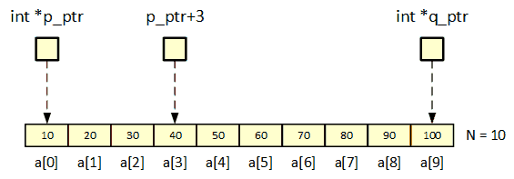

# Pointers and Arrays

When pointers point to array elements, C allows us to perform arithmetic (addition and subtraction) on 
the pointers, which leads to an alternative way of processing arrays in which pointers take the place 
of array indices.

## Array Arguments

When passed to a function, an array is always treated as a pointer which has some important consequences:
* An array used as an argument is **not protected against change** since no copy is made of the array itself.
* The time required to pass an array to a function doesn't depend on the size of the array.
    There is **no penalty for passing a large array**, since no copy of the array is made.
* An array **parameter can be declared as a pointer** if desired.    

    _Example_: Array argument (parameter declared as pointer) 
    ```C
    void fill_array(int n, int *v, int value)
    {
        for(int i=0; i<n; i++)
        {
            v[i] = value;
        }
    }
    ```
* If `const` is used for a array parameter, the compiler will check that **no assignment to an element** of 
    the array appears in the function body.

* A function with an array parameter can be passed an **array slice** - a sequence of consecutive elements.

    _Example_: 
    ```C
    fill_array(3, vector + 7, 0xee);
    ```
## Pointer Arithmetic and Arrays

The **name of an array** can be used as a **pointer to the first element** in the array.
In general, `a + i` is the same as `&a[i]` (pointer to element i of a) and `*(a+i)` is 
equivalent to `a[i]` (element i itself).



C supports three forms of pointer arithmetic:

* **Adding an integer to a pointer**.
    If a pointer `p_ptr` points to the array element `a[i]`, then `p_ptr + j` points to `a[i+j]`.
    
    _Example_: 
    ```C
    for(int i=0; i<N; i++)
    {
        assert(a[i] == *(p_ptr+i));
    }
    ```
  
* **Subtracting an integer from a pointer**.
    if `q_ptr` points to the array element `a[i]`, then `q_ptr - i` points to `a[i-j]`.

    _Example_:
    ```C
    for(int i=0; i<N; i++)
    {
        assert(a[N-1-i] == *(q_ptr-i));
    }  
    ```
    
* **Subtracting one pointer from another**.
    When one pointer is subtracted from another, the result is the distance (measured in array elements)
    between the pointers.
    If `p_ptr` points to `a[i]` und `q_ptr` points to `a[j]`, then `q_ptr - p_ptr` is equal to `i - j`.
    
    _Example_:
    ```C    
    int size = q_ptr - p_ptr + 1;
    assert(N == size);
    ```
As shown in the examples above, pointer arithmetic allows us to visit the elements of an array by 
repeatedly incrementing a pointer variable.
  
The argument most often cited in support of pointer arithmetic is that it can save execution time.
However, that depends on the implementation - some C compilers actually produce better code for loops 
that rely on indexing.  
  

  
## References
* K. N. King. **C Programming, A Modern Approach.** W. W. Norton & Company, inc. 2nd Edition 2008. 
    Chapter 12: Pointers and Arrays
 
*Egon Teiniker, 2020-2021, GPL v3.0* 