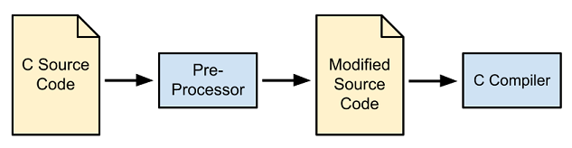

# Preprocessor

The preprocessor is a piece of software that **edits C programs just prior to compilation**. This makes C and also C++ unique among major programming languages.



The bahavior of the preprocessor is controlled by **preprocessing directives**:
commands that begin with a `#` character.

The input to the preprocessor is a C program, including directives.
The preprocessor executes these directives and modifies the source code.
The output of the preprocessor is another C program: an edited version of the original program,
containing no directives.

Most preprocessing directives fall into one of three categories:
* **Macro definition**: The `#define` directive defines a macro; the `#udef` directive removes a macro definition.

* **File inclusion**: The `#include` directive causes the contents of a specified file to be included in a program.

* **Conditional compilation**: The `#if`, `#ifdef`, `#ifndef`, `#elif`, `#else` 
and `#endif` directives allow blocks of text to be either included in or excluded from a program, depending on conditions that can be tested by the preprocessor.

The remaining directives `#error`, `#line`, and `#pragma` are more specialized and therefore used less often.

## Macro Definitions

The preprocessor support simple macros without parameters and also parameterized macros.

### Simple Macros
The definition of a simple macro has the form:
```C
#define identifier replacement
```

Where `replacement` is any sequence of preprocessing tokens which may include identifiers, keywords, 
numeric constants, character constants, string literals, operators, and punctuation. 
Whereever `identifier` appears later in the file, the preprocessor substitutes `replacement`.

_Example_: Simple macros from `Arduino.h`
```C
#define PI 3.1415926535897932384626433832795
#define HALF_PI 1.5707963267948966192313216916398
#define TWO_PI 6.283185307179586476925286766559
#define DEG_TO_RAD 0.017453292519943295769236907684886
#define RAD_TO_DEG 57.295779513082320876798154814105
#define EULER 2.718281828459045235360287471352
```

Using `#define` to create names for constants has several significant **advantages**:
* **It makes programs easier to read**: The name of the macro helps the reader understand the meaning of the constant. We don't want a program full of magic numbers. 

* **It makes programs easier to modify**: We can change the value of a constant throughout a program by modifying a single macro definition. Hard-coded constants are more difficult to change, especially since they sometimes appear in a slightly altered form.


### Parameterized Macros
The definition of a **parameterized macro** (a.k.a. **function-like macro**) has the form:
```C
#define identifier(x1, x2,..., xn) replacement
```
where `x1, x2,..., xn` are the macro's **parameters**. 
The parameters may appear as many times as desired in the `replacement`.

There must be **no space between the macro name and the left parenthesis**!

Wherever a macro invocation of the form `identifier(y1, y2,..., yn)` appears later in the program,
the preprocessor replaces it with the `replacement`, substituting `y1` for `x1`, `y2` for `x2`, and so forth.

_Example_: Parameterized macros from `Arduino.h`
```C
#define min(a,b) ((a)<(b)?(a):(b))
#define max(a,b) ((a)>(b)?(a):(b))
#define abs(x) ((x)>0?(x):-(x))
#define round(x)     ((x)>=0?(long)((x)+0.5):(long)((x)-0.5))
#define radians(deg) ((deg)*DEG_TO_RAD)
#define degrees(rad) ((rad)*RAD_TO_DEG)
#define sq(x) ((x)*(x))```
```

The replacements are full of **parentheses**. There are two rules to follow when deciding where to put  parentheses in a macro definition:

* If the macro's replacement contains an **operator**, always enclode the replacement in parentheses.

* If the macro has **parameters**, put parentheses around each parameter every time it appears in the replacement.

Without the parenteses, we can't guarantee that the compiler will treat replacements and arguments as whole expressions. The compiler may apply the rules of operator precedence and associativity in ways that we did not anticipate.


Using a parameterized macro instead of a true function has some **advantages**:

* **The program may be slightly faster**: A function call usually requires some overhead during program execution. A macro invocation, on the other hand, requires no run-time overhead.
Note that C99's **inline functions** provide a way to avoid this overhead without the use of macros.

* **Macros are generic**: Macro parameters have no particular type. As a result, a macro can accept arguments of any type, provided that the resulting program - after preprocessing - is valid.

But parameterized macros also have **disadvantages**:

* **The compiled code will often be larger**: Each macro invocation causes the insertion of the macro's
peplacement, thereby increasing the size of the source program and the compiled code.

* **Arguments are not type-checked**: When a function is called, the compiler checks each argument to see if it has the appropriate type.
If not, either the argument is converted to the proper type or the compiler produces as error message.
Macro arguments are not checked by the preprocessor, nor are they converted.

* **It is not possible to have a pointer to a macro**: C allows pointers to functions.
Macros are removed during preprocessing, so there's no corresponding notation of _pointer to a macro_.
As a result, macros can't be used in these situations.

Macros can be **undefined** by the `#undef` directive, which has the form:
```C
#undef identifier
```
where `identifier` is a macro name.

One use of `#undef` is to remove the existing definition of a macro so that it can be given a new function.

### Predefined Macros

C has several predefined macros. Each macro represent an integer constant or string literal.

* `__LINE__` Line number of file being compiled.
* `__FILE__` Name of file being compiled.
* `__DATE__` Date of compilation.
* `__TIME__` Time of compilation.

The `__DATE__` and `__TIME__` macros identify exactly when a program was compiled.

We can use the `__LINE__` and `__FILE__` macros to help locate errors.


## File Inclusion

The `#include` directive tells the preprocessor to open a particular file and include its content as part of the file being compiled.

Te include directive has two variants:
* `#include <file>`: This variant is used for system header files. It searches for a file named file in a standard list of system directories. We can prepend directories to this list with the `-I` option.

* `#include "file"`: This variant is used for header files of our own program. It searches for a file named file first in the directory containing the current file, then in the quote directories and then the same directories used for `<file>`. 


## Conditional Compilation

The C preprocessor recognizes a number of directives that support the inclusion or exclusion of a program text depending on the outcome of a test performed by the preprocessor - coditional compilation.

### The `#if` and `#endif` Directives

The `#if` and `#endif` directives have the forms:
```C
#if constant-expression
//...
#endif
```

When the preprocessor encounters the `#if` directive, it evaluates the `constant-expression`.

If the value of the expression is zero, the lines between `#if` and `#endif` will be removed from the program during preprocessing.
Otherwise, the lines between `#if` and `#endif` will remain in the program to be processed by the compiler.

The `#if` directive treats undefined identifiers as macros that have the value `0`.


When applied to an identifier, `defined` produces the value `1` if the identifier is a currently defined macro, otherwise it produces `0`.

The `defined` operator is normally used in conjunction with the `#if` directive.

Since defined tests only whether the macro is defined or not, it's not necessary to give the macro a value.

_Example_: Using defined 
```C
#define DEBUG

#if defined(DEBUG) 
//...
#endif
```

### The `#ifdef` and `#ifndef` Directives

The `#ifdef` directive tests whether an identifier is currently defined as macro.

Using `#ifdef` has the same effect as combining the `#if` directive with the defined operator.

```C
#ifdef identifier
//...
#endif
```
Is equivaltent to: 

```C
#if defined(identifier) 
//...
#endif
```

The `#ifndef` directive is similar to `#ifdef`, but tests whether an identifier is not defined as macro:

```C
#ifndef identifier
//...
#endif
```
Is equivaltent to: 

```C
#if !defined(identifier) 
//...
#endif
```

### The `#elif` and `#else` Directives

`#if`, `#ifdef`, and `#ifndef` blocks can be nested just like ordinary if statements.

```C
#if expr1
// Lines to be included if expr1 is nonzero
#elif expr2 
// Lines to be included if expr1 is zero but expr2 is nonzero
#else
// Lines to be included otherwise
#endif
```
Although the `#if` directive is shown above, an `#ifdef` or `#ifndef` directive can be used instead.

Some developers put a comment on each closing `#endif` to indicate what condition the matching `#if`
tests.


### Use Cases of Conditional Compilation

Here are a few common use cases for conditional compilation:

* **Writing logging and debugging code that can be removed in production**: 

    _Example_: Code from the Arduino-Log framework
    ```C
    int Logging::getLevel() const
    {
    #ifndef DISABLE_LOGGING
        return _level;
    #else
        return 0;
    #endif
    }
    ```

* **Writing programs that are portable to several machines or operating systems**:

    _Example_: Code that supports many Arduino platforms
    ```C
    int analogRead(uint8_t pin)
    {
    #if defined(analogPinToChannel)
    #if defined(__AVR_ATmega32U4__)
        if (pin >= 18) pin -= 18; // allow for channel or pin numbers
    #endif
        pin = analogPinToChannel(pin);
    #elif defined(__AVR_ATmega1280__) || defined(__AVR_ATmega2560__)
        if (pin >= 54) pin -= 54; // allow for channel or pin numbers
    #elif defined(__AVR_ATmega32U4__)
        if (pin >= 18) pin -= 18; // allow for channel or pin numbers
    #elif defined(__AVR_ATmega1284__) || defined(__AVR_ATmega1284P__) || defined(__AVR_ATmega644__) || defined(__AVR_ATmega644A__) || defined(__AVR_ATmega644P__) || defined(__AVR_ATmega644PA__)
        if (pin >= 24) pin -= 24; // allow for channel or pin numbers
    #else
        if (pin >= 14) pin -= 14; // allow for channel or pin numbers
    #endif
    //...
    }
    ```

* **Implementing include guards for C header files**:
    Include guards ensures that when a header file is included in multiple places, it will not be duplicated
    for the compiler's input.
    ```C
    #ifndef _MY_HEADER_FILE_H_
    #define _MY_HEADER_FILE_H_
    // Constants, prototypes...
    #endif /* _MY_HEADER_FILE_H_ */
    ```

* **Writing programms that can be compiled with different compilers**:
    Different compilers often recognize somewhat different versions of C.
    Conditional compilation can allow a program to adjust to different compilers.

    The __STDC__ macro allows the preprocessor to detect whether a compiler conforms to the standard (C99 or higher), if it doesn't, we may need to change cetain aspects of the program.
    ```C
    #if __STDC__
    // Function prototypes
    #else
    // Old-style function declarations 
    #endif
    ```

## References

* K. N. King. **C Programming, A Modern Approach.** W. W. Norton & Company, inc. 2nd Edition 2008. 
    * Chapter 14: The Preprocessor

*Egon Teiniker, 2020-2022, GPL v3.0* 
